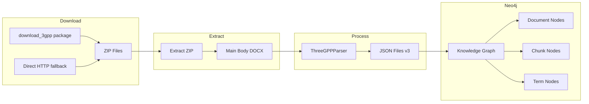

# 3GPP Document Download and Processing Pipeline

**Ngày tạo**: 2025-12-08
**Script**: `document_processing/download_and_process_3gpp.py`

## Tổng Quan

Pipeline hoàn chỉnh để:
1. Download 3GPP Release 18 specifications từ 3GPP archive
2. Extract ZIP files và tổ chức theo series
3. Process DOCX documents thành JSON format (v3)
4. Initialize Neo4j Knowledge Graph với complete data

## Kiến Trúc



## Commands

```bash
cd document_processing

# Check current status
python download_and_process_3gpp.py status

# Download 3GPP Release 18 (default series: 23,24,26,27,28,29,32,33,36,37,38)
python download_and_process_3gpp.py download

# Download specific series only
python download_and_process_3gpp.py download --series 23,29,38

# Extract ZIP files
python download_and_process_3gpp.py extract

# Process DOCX to JSON
python download_and_process_3gpp.py process

# Initialize Neo4j Knowledge Graph
python download_and_process_3gpp.py init-kg

# Run complete pipeline
python download_and_process_3gpp.py all

# Custom output directory
python download_and_process_3gpp.py all --output /path/to/output
```

## Directory Structure

```
document_processing/
├── data/
│   ├── rel18_download/       # Downloaded ZIP files
│   │   └── Rel-18/
│   │       ├── 23_series/
│   │       ├── 29_series/
│   │       └── ...
│   └── rel18_extracted/      # Extracted DOCX files
│       ├── 23_series/
│       │   ├── 23501-i80/
│       │   │   └── 23501-i80.docx
│       │   └── ...
│       └── ...
└── download_and_process_3gpp.py

3GPP_JSON_DOC/
└── processed_json_v3/        # Output JSON files
    ├── ts_23.501.json
    ├── ts_23.502.json
    └── ...
```

## Components

### 1. ThreeGPPDownloader

Download documents using `download_3gpp` package or direct HTTP fallback.

```python
downloader = ThreeGPPDownloader(config)

# Using download_3gpp package (recommended)
downloader.download_release(release=18, series=['23', '29'])

# Fallback: Direct HTTP requests
downloader.download_via_requests(release=18, series=['23', '29'])
```

**Features**:
- Auto-install `download_3gpp` if not present
- Download by release number
- Filter by series
- Fallback to direct HTTP if package fails
- Timeout handling (1h per series, 2h for all)

### 2. ThreeGPPExtractor

Extract ZIP files and organize by series.

```python
extractor = ThreeGPPExtractor(config)
count = extractor.extract_all()
```

**Features**:
- Extract only main body DOCX files
- Skip covers, annexes, amendments
- Organize by series folder
- Handle nested ZIP structures

### 3. ThreeGPPParser

Parse DOCX documents into structured JSON.

```python
parser = ThreeGPPParser()
chunks, metadata = parser.process_document("path/to/doc.docx")
parser.save_to_json(chunks, metadata, output_dir)
```

**Output JSON Format**:
```json
{
    "metadata": {
        "specification_id": "ts_23.501",
        "version": "18.9.0",
        "title": "3GPP TS 23.501",
        "release": "Rel-18",
        "file_path": "/path/to/file.docx"
    },
    "export_info": {
        "export_date": "2025-12-08T12:00:00",
        "total_chunks": 250,
        "pipeline_version": "v3"
    },
    "chunks": [
        {
            "chunk_id": "ts_23.501_4.1",
            "section_id": "4.1",
            "section_title": "General",
            "content": "...",
            "chunk_type": "definition",
            "cross_references": {
                "internal": [...],
                "external": [...]
            },
            "content_metadata": {
                "word_count": 150,
                "complexity_score": 0.45,
                "key_terms": ["AMF", "SMF", "UPF"]
            },
            "tables": [...]
        }
    ]
}
```

### 4. KnowledgeGraphInitializer

Initialize Neo4j from JSON files.

```python
initializer = KnowledgeGraphInitializer(config)
initializer.initialize(clear_first=True)
```

**Creates**:
- Document nodes (spec_id, version, title, release)
- Chunk nodes (content, section_title, chunk_type, key_terms)
- Term nodes (abbreviation, full_name, source_specs)
- Relationships: CONTAINS, REFERENCES_SPEC, DEFINED_IN

## Configuration

```python
@dataclass
class Config:
    # Directories
    download_dir: Path   # Where to download ZIP files
    data_dir: Path       # Where to extract DOCX files
    output_dir: Path     # Where to save JSON files

    # Settings
    release: int = 18
    series: List[str] = ['23', '24', '26', '27', '28', '29', '32', '33', '36', '37', '38']

    # Neo4j
    neo4j_uri: str = "neo4j://localhost:7687"
    neo4j_user: str = "neo4j"
    neo4j_password: str = "password"
```

## Series Coverage

| Series | Description | Examples |
|--------|-------------|----------|
| 23 | System Architecture | TS 23.501 (5G System), TS 23.502 (Procedures) |
| 24 | UE Services | TS 24.501 (NAS protocol) |
| 29 | APIs & Protocols | TS 29.500 (HTTP framework), TS 29.571 (Data Types) |
| 32 | Charging | TS 32.255 (5G Charging) |
| 33 | Security | TS 33.501 (5G Security) |
| 38 | Radio Access | TS 38.300 (NR Architecture) |

## Processing Details

### Main Body Detection

Files are identified as main body if:
- Filename contains "main body", "_1_", or "s\d+_s\d+"
- OR matches pattern `\d{5}-[a-z]\d{2}.docx` (e.g., 23501-i80.docx)

### Excluded Files

- Covers, annexes, history, amendments
- Temporary files (~$*.docx)

### Content Classification

| Type | Detection |
|------|-----------|
| definition | Title contains: definition, overview, general, scope |
| abbreviation | Title contains: abbreviation |
| procedure | Title contains: procedure, flow, process, registration |
| parameter | Title contains: parameter, identifier, ie, element |
| reference | Title contains: reference, normative |
| requirement | Content starts with: shall |
| interface | Title contains: interface, api, service |
| general | Default |

## Performance

### Expected Timing

| Stage | Time (350 docs) |
|-------|-----------------|
| Download | 30-60 min (depends on network) |
| Extract | 2-5 min |
| Process | 10-20 min (parallel) |
| Init KG | 5-10 min |
| **Total** | **~1-2 hours** |

### Resource Usage

- Disk: ~5-10 GB for download + extracted + JSON
- Memory: ~2-4 GB during processing
- CPU: Parallel processing (4 workers default)

## Troubleshooting

### Download Issues

```bash
# Try specific series first
python download_and_process_3gpp.py download --series 23

# Check if download_3gpp is installed
pip show download_3gpp

# Manual install
pip install download_3gpp
```

### Processing Errors

```bash
# Check extracted files
ls document_processing/data/rel18_extracted/

# Process with debug
python -c "
from download_and_process_3gpp import *
config = Config()
processor = ThreeGPPProcessor(config)
files = processor.find_docx_files()
print(f'Found {len(files)} files')
"
```

### Neo4j Issues

```bash
# Check Neo4j is running
docker ps | grep neo4j

# Start Neo4j
python orchestrator.py start-neo4j

# Check connection
python -c "
from neo4j import GraphDatabase
driver = GraphDatabase.driver('neo4j://localhost:7687', auth=('neo4j', 'password'))
with driver.session() as s:
    print(s.run('RETURN 1').single())
"
```

## Integration with Orchestrator

The pipeline can be integrated with main orchestrator:

```bash
# From project root
python orchestrator.py start-neo4j
cd document_processing
python download_and_process_3gpp.py all
cd ..
python orchestrator.py run
```

## Notes

- **download_3gpp** package: [PyPI](https://pypi.org/project/download_3gpp/)
- Release letter mapping: Rel-10='a', Rel-18='i'
- JSON v3 includes `release` field and `content_metadata`
- Parallel processing uses 4 workers by default
