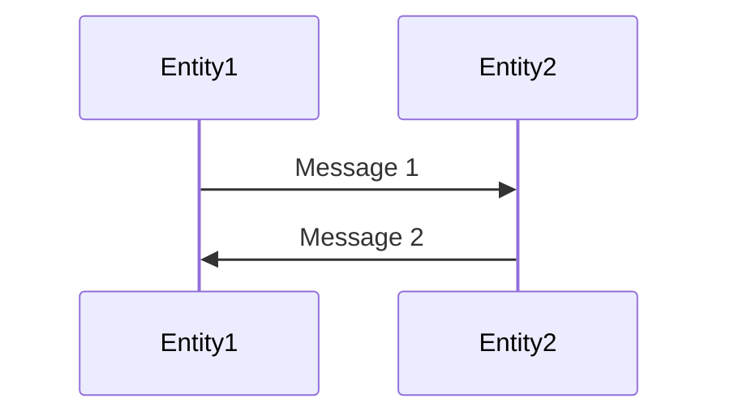

# Cải Thiện Chất Lượng Query và LLM cho RAG System

**Ngày tạo**: 2025-12-07
**Mục tiêu**: Nâng cao chất lượng retrieval và answer generation, tập trung vào query understanding và LLM integration

---

## 1. HYBRID SEARCH: Vector + Graph Retrieval

### 1.1. Vấn Đề Hiện Tại

**Hệ thống hiện tại**: Chỉ dùng graph-based retrieval với Cypher queries
- Rule-based pattern matching (8 question types cố định)
- Chỉ match exact keywords hoặc variations đơn giản
- Không hiểu semantic similarity

**Ví dụ thất bại**:
```python
Query 1: "What are the duties of AMF?"
Query 2: "What are the responsibilities of AMF?"
# Cùng ý nghĩa nhưng khác keyword → có thể cho kết quả khác nhau
```

### 1.2. Giải Pháp: Hybrid Retrieval

**Kiến trúc mới**:
```
User Query
    │
    ├─→ Vector Search (semantic similarity)
    │   └─→ Top 10 chunks based on embedding similarity
    │
    ├─→ Graph Search (structured queries)
    │   └─→ Top 10 chunks based on Cypher patterns
    │
    └─→ Reranker
        └─→ Final top 6 chunks (best of both)
```

### 1.3. Implementation Plan

#### Bước 1: Tạo Vector Embeddings cho Chunks

```python
# File: vector_indexer.py
from sentence_transformers import SentenceTransformer
import numpy as np
from neo4j import GraphDatabase

class VectorIndexer:
    """Tạo và lưu vector embeddings cho tất cả chunks trong Neo4j"""

    def __init__(self, neo4j_driver):
        self.driver = neo4j_driver
        # Model tốt cho technical text
        self.model = SentenceTransformer('sentence-transformers/all-mpnet-base-v2')

    def create_embeddings_for_all_chunks(self):
        """Tạo embeddings cho tất cả chunks"""
        with self.driver.session() as session:
            # Lấy tất cả chunks
            chunks = session.run("""
                MATCH (c:Chunk)
                RETURN c.chunk_id AS chunk_id, c.content AS content
            """).data()

            logger.info(f"Creating embeddings for {len(chunks)} chunks")

            batch_size = 100
            for i in range(0, len(chunks), batch_size):
                batch = chunks[i:i+batch_size]

                # Tạo embeddings
                contents = [c['content'] for c in batch]
                embeddings = self.model.encode(contents, show_progress_bar=True)

                # Lưu vào Neo4j
                for chunk, embedding in zip(batch, embeddings):
                    session.run("""
                        MATCH (c:Chunk {chunk_id: $chunk_id})
                        SET c.embedding = $embedding
                    """, chunk_id=chunk['chunk_id'],
                        embedding=embedding.tolist())

                logger.info(f"Processed {i+len(batch)}/{len(chunks)} chunks")

    def create_vector_index(self):
        """Tạo vector index trong Neo4j (v5.11+)"""
        with self.driver.session() as session:
            session.run("""
                CREATE VECTOR INDEX chunk_embeddings IF NOT EXISTS
                FOR (c:Chunk)
                ON c.embedding
                OPTIONS {indexConfig: {
                    `vector.dimensions`: 768,
                    `vector.similarity_function`: 'cosine'
                }}
            """)
            logger.info("Vector index created")
```

#### Bước 2: Vector Search Component

```python
# File: vector_retriever.py
from typing import List
from sentence_transformers import SentenceTransformer
from neo4j import GraphDatabase

class VectorRetriever:
    """Thực hiện vector-based semantic search"""

    def __init__(self, neo4j_driver):
        self.driver = neo4j_driver
        self.model = SentenceTransformer('sentence-transformers/all-mpnet-base-v2')

    def search(self, query: str, top_k: int = 10) -> List[dict]:
        """Vector similarity search"""
        # Tạo embedding cho query
        query_embedding = self.model.encode(query)

        # Search trong Neo4j vector index
        with self.driver.session() as session:
            results = session.run("""
                CALL db.index.vector.queryNodes('chunk_embeddings', $top_k, $query_vector)
                YIELD node, score
                RETURN node.chunk_id AS chunk_id,
                       node.spec_id AS spec_id,
                       node.section_id AS section_id,
                       node.section_title AS section_title,
                       node.content AS content,
                       node.chunk_type AS chunk_type,
                       node.complexity_score AS complexity_score,
                       node.key_terms AS key_terms,
                       score
                ORDER BY score DESC
                LIMIT $top_k
            """, query_vector=query_embedding.tolist(), top_k=top_k).data()

        return results
```

#### Bước 3: Hybrid Retriever

```python
# File: hybrid_retriever.py
from typing import List
from dataclasses import dataclass

@dataclass
class ScoredChunk:
    chunk_id: str
    spec_id: str
    section_id: str
    section_title: str
    content: str
    chunk_type: str
    complexity_score: float
    key_terms: List[str]
    retrieval_score: float
    retrieval_method: str  # 'vector', 'graph', or 'both'

class HybridRetriever:
    """Kết hợp vector search và graph search"""

    def __init__(self, neo4j_driver, cypher_generator, vector_retriever):
        self.driver = neo4j_driver
        self.cypher_generator = cypher_generator
        self.vector_retriever = vector_retriever
        self.logger = get_logger('Hybrid_Retriever')

    def retrieve(self, query: str, top_k: int = 6) -> List[ScoredChunk]:
        """Hybrid retrieval: vector + graph"""

        # 1. Vector search (semantic)
        self.logger.log(MINOR, "Performing vector search...")
        vector_results = self.vector_retriever.search(query, top_k=10)

        # 2. Graph search (structured)
        self.logger.log(MINOR, "Performing graph search...")
        analysis = self.cypher_generator.analyze_question(query)
        cypher_query = self.cypher_generator.generate_cypher_query(analysis)
        graph_results = self._execute_cypher(cypher_query)

        # 3. Merge và rerank
        self.logger.log(MINOR, "Merging and reranking results...")
        merged_results = self._merge_and_rerank(
            vector_results,
            graph_results,
            top_k=top_k
        )

        return merged_results

    def _merge_and_rerank(self, vector_results, graph_results, top_k):
        """Merge kết quả từ 2 nguồn và rerank"""

        # Tạo dict để merge
        chunk_scores = {}

        # Add vector results
        for i, result in enumerate(vector_results):
            chunk_id = result['chunk_id']
            # Score cao hơn cho rank cao hơn
            vector_score = result['score']

            chunk_scores[chunk_id] = {
                'data': result,
                'vector_score': vector_score,
                'graph_score': 0.0,
                'methods': ['vector']
            }

        # Add graph results
        for i, result in enumerate(graph_results):
            chunk_id = result['chunk_id']
            # Score based on position (1.0 cho top, giảm dần)
            graph_score = 1.0 - (i / len(graph_results))

            if chunk_id in chunk_scores:
                # Chunk xuất hiện ở cả 2 nguồn → boost score
                chunk_scores[chunk_id]['graph_score'] = graph_score
                chunk_scores[chunk_id]['methods'].append('graph')
            else:
                chunk_scores[chunk_id] = {
                    'data': result,
                    'vector_score': 0.0,
                    'graph_score': graph_score,
                    'methods': ['graph']
                }

        # Calculate final score
        # Ưu tiên chunks xuất hiện ở cả 2 nguồn
        for chunk_id, data in chunk_scores.items():
            vector_score = data['vector_score']
            graph_score = data['graph_score']

            if len(data['methods']) == 2:
                # Bonus cho chunks match cả 2
                final_score = (vector_score * 0.5 + graph_score * 0.5) * 1.2
            else:
                final_score = vector_score + graph_score

            data['final_score'] = final_score

        # Sort by final score
        ranked = sorted(
            chunk_scores.values(),
            key=lambda x: x['final_score'],
            reverse=True
        )[:top_k]

        # Convert to ScoredChunk
        results = []
        for item in ranked:
            data = item['data']
            results.append(ScoredChunk(
                chunk_id=data['chunk_id'],
                spec_id=data['spec_id'],
                section_id=data['section_id'],
                section_title=data['section_title'],
                content=data['content'],
                chunk_type=data['chunk_type'],
                complexity_score=data['complexity_score'],
                key_terms=data['key_terms'],
                retrieval_score=item['final_score'],
                retrieval_method='+'.join(item['methods'])
            ))

        return results

    def _execute_cypher(self, cypher_query):
        """Execute Cypher query"""
        with self.driver.session() as session:
            results = session.run(cypher_query).data()
        return results
```

#### Bước 4: Update RAG Orchestrator

```python
# Update trong rag_system_v2.py
class RAGOrchestratorV2:
    def __init__(self, config):
        # Thêm hybrid retriever
        self.vector_retriever = VectorRetriever(self.neo4j_driver)
        self.hybrid_retriever = HybridRetriever(
            neo4j_driver=self.neo4j_driver,
            cypher_generator=self.cypher_generator,
            vector_retriever=self.vector_retriever
        )

    def query(self, question, model="deepseek-r1:14b", use_hybrid=True):
        """Query với option để dùng hybrid retrieval"""

        if use_hybrid:
            # Dùng hybrid retrieval
            chunks = self.hybrid_retriever.retrieve(question, top_k=6)
        else:
            # Dùng graph-only (legacy)
            analysis = self.cypher_generator.analyze_question(question)
            cypher_query = self.cypher_generator.generate_cypher_query(analysis)
            chunks = self.knowledge_retriever.retrieve_with_cypher(cypher_query)

        # Generate answer
        answer = self.llm_integrator.generate_answer(
            query=question,
            retrieved_chunks=chunks,
            cypher_query=cypher_query,
            model=model
        )

        return RAGResponse(...)
```

---

## 2. CONVERSATION MEMORY & CONTEXT AWARENESS

### 2.1. Vấn Đề Hiện Tại

**Hệ thống hiện tại**: Mỗi query độc lập
```python
User: "What is AMF?"
Bot: [explains AMF in detail]

User: "What are its main functions?"
Bot: [doesn't know "its" = AMF, fails to answer]
```

### 2.2. Giải Pháp: Conversation Manager

```python
# File: conversation_manager.py
from typing import List, Dict, Optional
from dataclasses import dataclass
from datetime import datetime

@dataclass
class ConversationTurn:
    """Một turn trong conversation"""
    user_message: str
    bot_response: str
    entities_mentioned: List[str]  # ["AMF", "SMF", "registration"]
    timestamp: datetime

@dataclass
class ConversationContext:
    """Context từ conversation history"""
    recent_entities: List[str]  # Entities từ 3 turns gần nhất
    recent_topics: List[str]    # Topics discussed
    conversation_summary: str   # Summary của conversation

class ConversationManager:
    """Quản lý conversation history và context"""

    def __init__(self, rag_system, max_history=10):
        self.rag_system = rag_system
        self.history: List[ConversationTurn] = []
        self.max_history = max_history
        self.logger = get_logger('Conversation_Manager')

    def query_with_context(self, user_message: str, model: str = "deepseek-r1:14b") -> str:
        """Process query với conversation context"""

        # 1. Resolve references trong query
        resolved_query = self._resolve_references(user_message)
        self.logger.log(MINOR, f"Original: {user_message}")
        self.logger.log(MINOR, f"Resolved: {resolved_query}")

        # 2. Build conversation context
        conversation_context = self._build_context()

        # 3. Query RAG system với enriched query
        response = self.rag_system.query(
            question=resolved_query,
            model=model,
            conversation_context=conversation_context
        )

        # 4. Extract entities từ query và response
        entities = self._extract_entities(user_message, response.answer)

        # 5. Update history
        self._add_to_history(
            user_message=user_message,
            bot_response=response.answer,
            entities=entities
        )

        return response

    def _resolve_references(self, query: str) -> str:
        """Resolve pronouns và references"""

        if not self.history:
            return query  # No context yet

        # Get recent entities
        recent_entities = []
        for turn in self.history[-3:]:  # Last 3 turns
            recent_entities.extend(turn.entities_mentioned)

        # Remove duplicates, keep order
        seen = set()
        recent_entities = [e for e in recent_entities if not (e in seen or seen.add(e))]

        # Resolve pronouns
        resolved = query

        # "it", "its" → most recent entity
        if recent_entities:
            most_recent = recent_entities[-1]

            patterns = [
                (r'\bit\b', most_recent),
                (r'\bits\b', f"{most_recent}'s"),
                (r'\bthey\b', ' and '.join(recent_entities[-2:])),
                (r'\bthem\b', ' and '.join(recent_entities[-2:])),
            ]

            for pattern, replacement in patterns:
                if re.search(pattern, resolved, re.IGNORECASE):
                    resolved = re.sub(pattern, replacement, resolved, flags=re.IGNORECASE)
                    self.logger.log(MINOR, f"Resolved '{pattern}' to '{replacement}'")

        # Resolve "the function", "the procedure" → recent topic
        if re.search(r'\bthe (function|procedure|protocol|entity)\b', resolved, re.IGNORECASE):
            if recent_entities:
                resolved = re.sub(
                    r'\bthe (function|procedure|protocol|entity)\b',
                    recent_entities[-1],
                    resolved,
                    flags=re.IGNORECASE
                )

        return resolved

    def _build_context(self) -> ConversationContext:
        """Build context từ conversation history"""

        if not self.history:
            return ConversationContext(
                recent_entities=[],
                recent_topics=[],
                conversation_summary=""
            )

        # Get entities từ last 3 turns
        recent_entities = []
        for turn in self.history[-3:]:
            recent_entities.extend(turn.entities_mentioned)

        # Remove duplicates
        recent_entities = list(set(recent_entities))

        # Extract topics (simplified - có thể dùng LLM)
        recent_topics = self._extract_topics(self.history[-3:])

        # Create summary
        if len(self.history) > 3:
            summary = f"Previous discussion covered: {', '.join(recent_topics)}"
        else:
            summary = "Beginning of conversation"

        return ConversationContext(
            recent_entities=recent_entities,
            recent_topics=recent_topics,
            conversation_summary=summary
        )

    def _extract_entities(self, query: str, response: str) -> List[str]:
        """Extract entities (3GPP terms) từ query và response"""

        # Load known entities từ Neo4j Term nodes
        known_entities = self.rag_system.cypher_generator.entities

        entities = []
        text = f"{query} {response}".upper()

        for entity in known_entities:
            if entity.upper() in text:
                entities.append(entity)

        return entities

    def _extract_topics(self, turns: List[ConversationTurn]) -> List[str]:
        """Extract topics từ conversation turns"""

        # Simplified: return entities as topics
        topics = []
        for turn in turns:
            topics.extend(turn.entities_mentioned)

        return list(set(topics))

    def _add_to_history(self, user_message: str, bot_response: str, entities: List[str]):
        """Add turn to history"""

        turn = ConversationTurn(
            user_message=user_message,
            bot_response=bot_response,
            entities_mentioned=entities,
            timestamp=datetime.now()
        )

        self.history.append(turn)

        # Trim history if too long
        if len(self.history) > self.max_history:
            self.history = self.history[-self.max_history:]

        self.logger.log(DEBUG, f"History size: {len(self.history)}")

    def clear_history(self):
        """Clear conversation history"""
        self.history = []
        self.logger.log(MINOR, "Conversation history cleared")

    def get_history_summary(self) -> str:
        """Get readable summary of conversation"""
        if not self.history:
            return "No conversation yet"

        lines = []
        for i, turn in enumerate(self.history, 1):
            lines.append(f"{i}. User: {turn.user_message[:50]}...")
            lines.append(f"   Bot: {turn.bot_response[:50]}...")
            lines.append(f"   Entities: {', '.join(turn.entities_mentioned)}")

        return '\n'.join(lines)
```

### 2.3. Integration với Django

```python
# Update chatbot_project/chatbot/views.py
class ChatAPIView(View):
    def post(self, request):
        # Get conversation_id từ session
        conversation_id = request.session.get('conversation_id')

        if not conversation_id:
            # Tạo conversation mới
            conversation_id = str(uuid.uuid4())
            request.session['conversation_id'] = conversation_id
            rag_manager.create_conversation(conversation_id)

        # Query với conversation context
        response = rag_manager.query_with_conversation(
            conversation_id=conversation_id,
            message=user_message,
            model=backend_model
        )

        return JsonResponse({
            'user_message': user_message,
            'bot_response': response.answer,
            'conversation_id': conversation_id
        })

# Update rag_manager.py
class RAGManager:
    def __init__(self):
        self.rag_system = None
        self.conversations = {}  # {conversation_id: ConversationManager}

    def create_conversation(self, conversation_id):
        """Create new conversation"""
        self.conversations[conversation_id] = ConversationManager(self.rag_system)

    def query_with_conversation(self, conversation_id, message, model):
        """Query với conversation context"""
        if conversation_id not in self.conversations:
            self.create_conversation(conversation_id)

        conv_manager = self.conversations[conversation_id]
        return conv_manager.query_with_context(message, model)

    def clear_conversation(self, conversation_id):
        """Clear conversation history"""
        if conversation_id in self.conversations:
            self.conversations[conversation_id].clear_history()
```

---

## 3. QUERY UNDERSTANDING VỚI LLM

### 3.1. Vấn Đề Hiện Tại

**Hệ thống hiện tại**: 8 question types cố định với regex patterns
- Brittle, không linh hoạt
- Không handle complex queries
- Không handle multi-intent queries

**Ví dụ thất bại**:
```python
Query: "Compare AMF and SMF, and explain how they interact during registration"
# Multi-intent: comparison + procedure
# Hệ thống hiện tại chỉ pick 1 intent
```

### 3.2. Giải Pháp: LLM-based Query Analyzer

```python
# File: semantic_query_analyzer.py
from typing import List, Dict
from dataclasses import dataclass
import json

@dataclass
class QueryIntent:
    """Intent được phát hiện trong query"""
    intent_type: str  # definition, comparison, procedure, etc.
    entities: List[str]  # ["AMF", "SMF"]
    sub_questions: List[str]  # Broken down sub-questions
    priority: int  # 1 = primary, 2 = secondary

@dataclass
class QueryAnalysis:
    """Kết quả phân tích query"""
    original_query: str
    primary_intent: str
    all_intents: List[QueryIntent]
    entities: List[str]
    complexity: int  # 1-5
    requires_multi_step: bool
    suggested_strategy: str

class SemanticQueryAnalyzer:
    """Phân tích query bằng LLM để hiểu intent"""

    def __init__(self, llm_integrator):
        self.llm = llm_integrator
        self.logger = get_logger('Query_Analyzer')

    def analyze_query(self, query: str, model: str = "deepseek-r1:14b") -> QueryAnalysis:
        """Analyze query để extract intents và entities"""

        # Prompt cho LLM
        analysis_prompt = f"""Analyze this 3GPP technical question and extract information in JSON format.

Question: {query}

Extract the following information:

1. Primary intent (main question type):
   - definition: asking what something is
   - comparison: comparing 2+ entities
   - procedure: asking how something works
   - reference: asking which specs define something
   - network_function: asking about role/function of entity
   - relationship: asking how entities relate
   - specification: asking about spec content
   - multiple_choice: multiple choice question

2. All intents: if question has multiple parts, list all intents with priority

3. Entities: all 3GPP terms mentioned (AMF, SMF, UPF, etc.)

4. Sub-questions: break down complex questions into simpler parts

5. Complexity (1-5):
   - 1: simple definition
   - 2: single entity function/procedure
   - 3: comparison or multi-entity
   - 4: complex procedure with multiple steps
   - 5: multi-intent or very technical

6. Requires multi-step: true if needs multiple retrieval steps

7. Suggested strategy:
   - single_query: simple, one Cypher query enough
   - multi_step: need multiple queries
   - hybrid: need both vector and graph search

Return ONLY valid JSON, no explanation:
{{
  "primary_intent": "...",
  "all_intents": [
    {{"intent_type": "...", "entities": [...], "sub_questions": [...], "priority": 1}}
  ],
  "entities": [...],
  "complexity": 3,
  "requires_multi_step": false,
  "suggested_strategy": "single_query"
}}
"""

        # Call LLM
        self.logger.log(MINOR, "Analyzing query with LLM...")

        if model == "claude":
            response = self._analyze_with_claude(analysis_prompt)
        else:
            response = self._analyze_with_local_llm(analysis_prompt, model)

        # Parse JSON response
        try:
            analysis_dict = json.loads(response)
        except json.JSONDecodeError:
            # Fallback to regex-based analysis
            self.logger.log(ERROR, "LLM response not valid JSON, using fallback")
            return self._fallback_analysis(query)

        # Convert to QueryAnalysis object
        intents = [
            QueryIntent(
                intent_type=intent['intent_type'],
                entities=intent['entities'],
                sub_questions=intent.get('sub_questions', []),
                priority=intent.get('priority', 1)
            )
            for intent in analysis_dict['all_intents']
        ]

        analysis = QueryAnalysis(
            original_query=query,
            primary_intent=analysis_dict['primary_intent'],
            all_intents=intents,
            entities=analysis_dict['entities'],
            complexity=analysis_dict['complexity'],
            requires_multi_step=analysis_dict['requires_multi_step'],
            suggested_strategy=analysis_dict['suggested_strategy']
        )

        self.logger.log(MAJOR, f"Query analysis: intent={analysis.primary_intent}, "
                              f"entities={analysis.entities}, complexity={analysis.complexity}")

        return analysis

    def _analyze_with_claude(self, prompt: str) -> str:
        """Analyze with Claude API"""
        message = self.llm.claude_client.messages.create(
            model="claude-3-haiku-20240307",
            max_tokens=1000,
            temperature=0.0,  # Deterministic for JSON
            messages=[{"role": "user", "content": prompt}]
        )
        return message.content[0].text

    def _analyze_with_local_llm(self, prompt: str, model: str) -> str:
        """Analyze with local LLM"""
        payload = {
            "model": model,
            "messages": [{"role": "user", "content": prompt}],
            "stream": False,
            "temperature": 0.0,
            "format": "json"  # Ollama JSON mode
        }

        response = requests.post(self.llm.local_llm_url, json=payload, timeout=60)
        response.raise_for_status()
        return response.json()['message']['content']

    def _fallback_analysis(self, query: str) -> QueryAnalysis:
        """Fallback to rule-based analysis"""
        # Reuse existing logic từ CypherQueryGenerator
        # (code từ analyze_question hiện tại)
        pass
```

### 3.3. Multi-Step Query Execution

```python
# File: multi_step_executor.py
class MultiStepQueryExecutor:
    """Execute complex queries bằng multiple retrieval steps"""

    def __init__(self, hybrid_retriever, llm_integrator):
        self.retriever = hybrid_retriever
        self.llm = llm_integrator
        self.logger = get_logger('Multi_Step_Executor')

    def execute(self, analysis: QueryAnalysis, model: str) -> RAGResponse:
        """Execute query based on analysis"""

        if not analysis.requires_multi_step:
            # Simple single query
            return self._execute_single_step(analysis, model)
        else:
            # Multi-step execution
            return self._execute_multi_step(analysis, model)

    def _execute_single_step(self, analysis: QueryAnalysis, model: str) -> RAGResponse:
        """Simple single retrieval"""
        chunks = self.retriever.retrieve(analysis.original_query, top_k=6)

        answer = self.llm.generate_answer(
            query=analysis.original_query,
            retrieved_chunks=chunks,
            model=model
        )

        return RAGResponse(
            answer=answer,
            sources=chunks,
            query=analysis.original_query,
            cypher_query="hybrid_search",
            retrieval_strategy="single_step",
            timestamp=datetime.now()
        )

    def _execute_multi_step(self, analysis: QueryAnalysis, model: str) -> RAGResponse:
        """Multi-step retrieval và synthesis"""

        self.logger.log(MAJOR, f"Executing multi-step query with {len(analysis.all_intents)} intents")

        # Step 1: Retrieve cho mỗi sub-intent
        all_chunks = []
        for intent in analysis.all_intents:
            # Generate sub-query
            if intent.sub_questions:
                sub_query = intent.sub_questions[0]
            else:
                sub_query = f"{intent.intent_type} {' '.join(intent.entities)}"

            self.logger.log(MINOR, f"Sub-query: {sub_query}")

            # Retrieve
            chunks = self.retriever.retrieve(sub_query, top_k=4)
            all_chunks.extend(chunks)

        # Step 2: Deduplicate chunks
        seen_ids = set()
        unique_chunks = []
        for chunk in all_chunks:
            if chunk.chunk_id not in seen_ids:
                unique_chunks.append(chunk)
                seen_ids.add(chunk.chunk_id)

        # Keep top 8 chunks
        unique_chunks = unique_chunks[:8]

        # Step 3: Generate comprehensive answer
        # Thêm context về multi-step nature
        enhanced_prompt = f"""This is a complex question with multiple parts:
{analysis.original_query}

Sub-questions to address:
{chr(10).join(f"- {intent.intent_type}: {', '.join(intent.entities)}" for intent in analysis.all_intents)}

Please provide a comprehensive answer addressing all parts.
"""

        answer = self.llm.generate_answer(
            query=enhanced_prompt,
            retrieved_chunks=unique_chunks,
            model=model
        )

        return RAGResponse(
            answer=answer,
            sources=unique_chunks,
            query=analysis.original_query,
            cypher_query="multi_step_hybrid",
            retrieval_strategy=f"multi_step_{len(analysis.all_intents)}_intents",
            timestamp=datetime.now()
        )
```

---

## 4. QUERY EXPANSION & REFORMULATION

### 4.1. Vấn Đề

Query từ user có thể không optimal cho retrieval
- Thiếu context
- Dùng từ đồng nghĩa khác với document
- Quá ngắn hoặc quá dài

### 4.2. Giải Pháp: Query Expander

```python
# File: query_expander.py
class QueryExpander:
    """Expand và reformulate query để improve retrieval"""

    def __init__(self, term_dict):
        self.term_dict = term_dict  # abbreviation → full_name mapping
        self.logger = get_logger('Query_Expander')

    def expand(self, query: str) -> List[str]:
        """Generate query variations"""

        variations = [query]  # Original

        # 1. Expand abbreviations
        expanded = self._expand_abbreviations(query)
        if expanded != query:
            variations.append(expanded)

        # 2. Add synonyms
        with_synonyms = self._add_synonyms(query)
        variations.extend(with_synonyms)

        # 3. Extract keywords (remove question words)
        keywords = self._extract_keywords(query)
        if keywords != query:
            variations.append(keywords)

        # 4. Add technical variations
        technical = self._add_technical_terms(query)
        variations.extend(technical)

        # Remove duplicates
        variations = list(set(variations))

        self.logger.log(MINOR, f"Generated {len(variations)} query variations")
        return variations

    def _expand_abbreviations(self, query: str) -> str:
        """Expand abbreviations to full names"""
        expanded = query

        for abbr, full_name in self.term_dict.items():
            # Match whole word only
            pattern = r'\b' + re.escape(abbr) + r'\b'
            if re.search(pattern, expanded, re.IGNORECASE):
                # Replace with "abbr (full_name)"
                replacement = f"{abbr} ({full_name})"
                expanded = re.sub(pattern, replacement, expanded, flags=re.IGNORECASE)

        return expanded

    def _add_synonyms(self, query: str) -> List[str]:
        """Add common synonyms"""
        synonym_map = {
            'role': ['function', 'responsibility', 'duty', 'purpose'],
            'function': ['role', 'responsibility', 'purpose'],
            'procedure': ['process', 'flow', 'steps'],
            'how': ['procedure for', 'steps to', 'process of'],
            'what': ['definition of', 'explanation of'],
            'difference': ['comparison', 'distinguish', 'contrast'],
        }

        variations = []

        for word, synonyms in synonym_map.items():
            if word in query.lower():
                for syn in synonyms:
                    # Replace word with synonym
                    var = re.sub(
                        r'\b' + word + r'\b',
                        syn,
                        query,
                        flags=re.IGNORECASE
                    )
                    if var != query:
                        variations.append(var)

        return variations[:3]  # Limit to 3 variations

    def _extract_keywords(self, query: str) -> str:
        """Extract main keywords, remove filler words"""
        # Remove question words
        stopwords = ['what', 'is', 'are', 'the', 'a', 'an', 'how', 'does',
                    'do', 'can', 'which', 'where', 'when', 'why']

        words = query.split()
        keywords = [w for w in words if w.lower() not in stopwords]

        return ' '.join(keywords)

    def _add_technical_terms(self, query: str) -> List[str]:
        """Add technical context"""
        variations = []

        # If asking about entity, add "in 5G" context
        if any(term in query.upper() for term in ['AMF', 'SMF', 'UPF', 'PCF', 'UDM']):
            variations.append(f"{query} in 5G system")
            variations.append(f"{query} 3GPP")

        return variations
```

### 4.3. Integration với Hybrid Retriever

```python
# Update hybrid_retriever.py
class HybridRetriever:
    def __init__(self, neo4j_driver, cypher_generator, vector_retriever, query_expander):
        self.query_expander = query_expander
        # ...

    def retrieve(self, query: str, top_k: int = 6, use_expansion: bool = True) -> List[ScoredChunk]:
        """Hybrid retrieval with optional query expansion"""

        if use_expansion:
            # Generate query variations
            query_variations = self.query_expander.expand(query)
            self.logger.log(MINOR, f"Using {len(query_variations)} query variations")

            # Retrieve with each variation
            all_results = {}
            for var in query_variations:
                results = self._retrieve_single(var, top_k=10)

                # Merge results
                for result in results:
                    chunk_id = result.chunk_id
                    if chunk_id in all_results:
                        # Boost score if found in multiple variations
                        all_results[chunk_id].retrieval_score += result.retrieval_score * 0.3
                    else:
                        all_results[chunk_id] = result

            # Sort and return top_k
            final_results = sorted(
                all_results.values(),
                key=lambda x: x.retrieval_score,
                reverse=True
            )[:top_k]

            return final_results
        else:
            # Standard retrieval
            return self._retrieve_single(query, top_k)

    def _retrieve_single(self, query: str, top_k: int):
        """Single retrieval (existing logic)"""
        # ... existing code ...
```

---

## 5. IMPROVED LLM PROMPTS

### 5.1. Vấn Đề Hiện Tại

Prompts có thể được cải thiện để:
- Tăng độ chính xác
- Giảm hallucination
- Better formatting
- Domain-specific instructions

### 5.2. Enhanced Prompt Templates

```python
# File: prompt_templates.py
class PromptTemplates:
    """Enhanced prompt templates cho different question types"""

    @staticmethod
    def get_definition_prompt(query: str, context: str, entities: List[str]) -> str:
        """Prompt for definition questions"""
        return f"""You are a 3GPP telecommunications expert. Answer this definition question precisely.

Question: {query}

Entities to define: {', '.join(entities)}

Context from 3GPP specifications:
{context}

Instructions:
1. Provide clear, technical definition based ONLY on the context
2. Structure your answer:
   - **Definition**: Clear 1-2 sentence definition
   - **Key Characteristics**: Bullet points of main features
   - **Related Entities**: How it relates to other 3GPP components
   - **Specification Reference**: Which specs define it (from context)

3. Use proper 3GPP terminology
4. Bold important terms like **{entities[0]}**, **5G Core**, etc.
5. If abbreviation, always show: **{entities[0]}** (Full Name)

CRITICAL Anti-Hallucination Rules:
- Use ONLY information from the provided context
- If context lacks sufficient info, state: "Based on the provided specifications, I can confirm [what you found], but detailed information about [missing info] is not available in these sections."
- DO NOT use general knowledge - stick to the context
- Always cite spec sections (e.g., "According to TS 23.501 Section 5.2...")

Format using Markdown with clear sections.
"""

    @staticmethod
    def get_comparison_prompt(query: str, context: str, entities: List[str]) -> str:
        """Prompt for comparison questions"""
        return f"""You are a 3GPP telecommunications expert. Compare these entities based on specifications.

Question: {query}

Entities to compare: {', '.join(entities)}

Context from 3GPP specifications:
{context}

Instructions:
1. Provide systematic comparison using this structure:

## Comparison: {' vs '.join(entities)}

### Overview
- Brief description of each entity

### Key Differences
| Aspect | {entities[0]} | {entities[1] if len(entities) > 1 else 'Other'} |
|--------|---------------|---------------|
| Primary Role | ... | ... |
| Key Functions | ... | ... |
| Interfaces | ... | ... |
| Location | ... | ... |

### Similarities
- Common aspects between them

### Interaction
- How they work together (if applicable)
- Include Mermaid diagram if helpful:

```mermaid
graph LR
    A[{entities[0]}] -->|interaction| B[{entities[1] if len(entities) > 1 else 'Other'}]
```

### Specification References
- List relevant spec sections

CRITICAL Rules:
- Base comparison ONLY on provided context
- If information missing for one entity, explicitly state it
- Use technical terminology from 3GPP specs
- Cite specific sections for each point
"""

    @staticmethod
    def get_procedure_prompt(query: str, context: str) -> str:
        """Prompt for procedure questions"""
        return f"""You are a 3GPP telecommunications expert. Explain this procedure step-by-step.

Question: {query}

Context from 3GPP specifications:
{context}

Instructions:
1. Structure your answer:

## Procedure: [Procedure Name]

### Overview
Brief description of what this procedure accomplishes

### Prerequisites
- What must be in place before this procedure

### Step-by-Step Flow

1. **[Step Name]**
   - Description
   - Entities involved: **Entity1**, **Entity2**
   - Messages exchanged

2. **[Step Name]**
   - Description
   - ...

### Message Flow Diagram



### Success Criteria
- How to know procedure completed successfully

### Error Cases
- Common failure scenarios (if mentioned in context)

### Specification References
- Cite relevant sections

CRITICAL Rules:
- Follow EXACT sequence from specifications
- Don't skip steps
- Don't add steps not in context
- Use proper message names from specs
"""

    @staticmethod
    def get_multi_intent_prompt(query: str, context: str, intents: List[QueryIntent]) -> str:
        """Prompt for complex multi-intent questions"""

        intent_descriptions = '\n'.join([
            f"- {intent.intent_type.upper()}: {', '.join(intent.entities)}"
            for intent in intents
        ])

        return f"""You are a 3GPP telecommunications expert. Answer this complex multi-part question.

Question: {query}

This question has multiple intents:
{intent_descriptions}

Context from 3GPP specifications:
{context}

Instructions:
1. Address EACH intent separately with clear sections
2. Structure your answer:

## Part 1: [Intent Type - Entities]
[Answer for first intent]

## Part 2: [Intent Type - Entities]
[Answer for second intent]

## Synthesis
[How the parts relate to each other - big picture]

3. Use appropriate formatting for each intent type
4. Include diagrams where helpful
5. Provide comprehensive specification references at the end

CRITICAL Rules:
- Address ALL intents, don't skip any
- Base everything on provided context
- If one intent cannot be fully answered, state it clearly
- Maintain technical accuracy
"""
```

### 5.3. Update LLM Integrator

```python
# Update rag_system_v2.py - LLMIntegrator
class LLMIntegrator:
    def generate_answer(self, query: str, retrieved_chunks: List[RetrievedChunk],
                       cypher_query: str, model: str = "claude",
                       query_analysis: Optional[QueryAnalysis] = None) -> str:
        """Generate answer với query analysis"""

        # Prepare context
        context = self._prepare_context(retrieved_chunks)

        # Select appropriate prompt template
        if query_analysis:
            if query_analysis.requires_multi_step:
                prompt = PromptTemplates.get_multi_intent_prompt(
                    query, context, query_analysis.all_intents
                )
            elif query_analysis.primary_intent == 'definition':
                prompt = PromptTemplates.get_definition_prompt(
                    query, context, query_analysis.entities
                )
            elif query_analysis.primary_intent == 'comparison':
                prompt = PromptTemplates.get_comparison_prompt(
                    query, context, query_analysis.entities
                )
            elif query_analysis.primary_intent == 'procedure':
                prompt = PromptTemplates.get_procedure_prompt(query, context)
            else:
                # Default prompt
                prompt = self._build_default_prompt(query, context)
        else:
            # Fallback to default
            prompt = self._build_default_prompt(query, context)

        # Route to LLM
        if model == "claude":
            return self._generate_with_api(prompt)
        else:
            return self._generate_with_local_llm(prompt, model)
```

---

## 6. IMPLEMENTATION ROADMAP

### Phase 1: Hybrid Search (Tuần 1-2)
- [ ] Setup vector embedding model (sentence-transformers)
- [ ] Create embeddings cho tất cả chunks
- [ ] Tạo Neo4j vector index
- [ ] Implement VectorRetriever
- [ ] Implement HybridRetriever
- [ ] Update RAGOrchestratorV2
- [ ] Test và benchmark accuracy

### Phase 2: Conversation Memory (Tuần 2-3)
- [ ] Implement ConversationManager
- [ ] Reference resolution logic
- [ ] Context building from history
- [ ] Entity extraction
- [ ] Integration với Django views
- [ ] Update RAGManager
- [ ] Test multi-turn conversations

### Phase 3: LLM Query Understanding (Tuần 3-4)
- [ ] Implement SemanticQueryAnalyzer
- [ ] Create analysis prompts
- [ ] Test với local LLM (DeepSeek)
- [ ] Implement MultiStepQueryExecutor
- [ ] Integration với retrieval pipeline
- [ ] Benchmark vs rule-based

### Phase 4: Query Expansion (Tuần 4-5)
- [ ] Implement QueryExpander
- [ ] Build synonym dictionary
- [ ] Abbreviation expansion
- [ ] Integration với HybridRetriever
- [ ] A/B testing expansion strategies

### Phase 5: Enhanced Prompts (Tuần 5-6)
- [ ] Create PromptTemplates class
- [ ] Design prompts cho each intent type
- [ ] Update LLMIntegrator
- [ ] Test prompt quality
- [ ] Iterate based on results

### Phase 6: Testing & Optimization (Tuần 6-7)
- [ ] Run comprehensive benchmarks
- [ ] Compare với baseline (current system)
- [ ] Optimize retrieval parameters
- [ ] Optimize prompt templates
- [ ] Document improvements

---

## 7. METRICS & EVALUATION

### 7.1. Metrics để Track

```python
# File: evaluation_metrics.py
class RAGEvaluationMetrics:
    """Metrics for evaluating RAG improvements"""

    @staticmethod
    def calculate_retrieval_metrics(retrieved_chunks, ground_truth_chunks):
        """Retrieval quality metrics"""
        retrieved_ids = {c.chunk_id for c in retrieved_chunks}
        ground_truth_ids = {c.chunk_id for c in ground_truth_chunks}

        # Precision, Recall, F1
        true_positives = len(retrieved_ids & ground_truth_ids)
        precision = true_positives / len(retrieved_ids) if retrieved_ids else 0
        recall = true_positives / len(ground_truth_ids) if ground_truth_ids else 0
        f1 = 2 * precision * recall / (precision + recall) if (precision + recall) > 0 else 0

        return {
            'precision': precision,
            'recall': recall,
            'f1': f1,
            'retrieved_count': len(retrieved_ids)
        }

    @staticmethod
    def calculate_answer_metrics(generated_answer, reference_answer):
        """Answer quality metrics"""
        # BLEU, ROUGE scores
        # Semantic similarity
        # Citation accuracy
        pass
```

### 7.2. Benchmark Test Suite

Update `test_tele_qna_benchmark.py` để track improvements:
- Accuracy (hiện tại)
- Retrieval precision/recall (mới)
- Answer quality scores (mới)
- Response time (hiện tại)
- Citation quality (mới)

---

## 8. KẾT LUẬN

Các cải thiện này sẽ nâng RAG system lên gần mức NotebookLM về:

✅ **Query Understanding**: LLM-based semantic analysis thay vì rule-based
✅ **Retrieval Quality**: Hybrid vector + graph search
✅ **Conversation**: Multi-turn context awareness
✅ **Flexibility**: Query expansion và reformulation
✅ **Answer Quality**: Enhanced prompts cho từng intent type

**Ưu tiên triển khai**:
1. Hybrid Search (impact cao nhất)
2. Conversation Memory (critical cho UX)
3. LLM Query Understanding (flexibility)
4. Query Expansion (marginal gains)
5. Enhanced Prompts (polish)

Thời gian dự kiến: **6-7 tuần** cho full implementation và testing.
