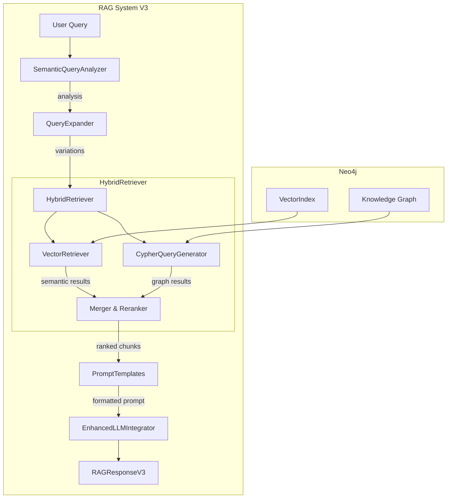

# RAG System V3 - Implementation Documentation

**Ngày tạo**: 2025-12-07
**Phiên bản**: 3.0

---

## Tổng Quan

RAG System V3 là bản nâng cấp với 3 cải tiến chính:
1. **Hybrid Retrieval**: Kết hợp Vector Search + Graph Search
2. **LLM Query Understanding**: Phân tích query bằng LLM
3. **Enhanced Prompts**: Template chuyên biệt cho từng loại câu hỏi

## Kiến Trúc



## File Structure

```
3GPP/
├── rag_system_v3.py          # Main orchestrator V3
├── hybrid_retriever.py       # Vector + Graph retrieval
│   ├── VectorIndexer         # Create embeddings & index
│   ├── VectorRetriever       # Semantic search
│   ├── SemanticQueryAnalyzer # LLM query understanding
│   ├── QueryExpander         # Query variations
│   └── HybridRetriever       # Combine & rerank
├── prompt_templates.py       # Enhanced prompt templates
│   ├── PromptTemplates       # Intent-specific prompts
│   └── ContextBuilder        # Context formatting
└── rag_system_v2.py          # Legacy (still usable)
```

## Components Chi Tiết

### 1. VectorIndexer

Tạo embeddings và Neo4j vector index cho semantic search.

```python
from hybrid_retriever import VectorIndexer
from neo4j import GraphDatabase

driver = GraphDatabase.driver("neo4j://localhost:7687", auth=("neo4j", "password"))
indexer = VectorIndexer(driver, embedding_model="sentence-transformers/all-MiniLM-L6-v2")

# Kiểm tra status
with_emb, total = indexer.check_embeddings_exist()
print(f"Embeddings: {with_emb}/{total}")

# Tạo embeddings (chạy 1 lần)
indexer.create_embeddings_for_all_chunks(batch_size=50)

# Tạo vector index (chạy 1 lần)
indexer.create_vector_index()
```

**Embedding Model**: `sentence-transformers/all-MiniLM-L6-v2`
- Dimension: 384
- Tốc độ: Nhanh
- Quality: Tốt cho technical text

### 2. VectorRetriever

Thực hiện semantic similarity search.

```python
from hybrid_retriever import VectorRetriever

retriever = VectorRetriever(driver)
results = retriever.search("What is AMF?", top_k=10)
for chunk in results:
    print(f"{chunk.chunk_id}: score={chunk.retrieval_score:.3f}")
```

**Neo4j Vector Index Query**:
```cypher
CALL db.index.vector.queryNodes('chunk_embeddings', $top_k, $query_vector)
YIELD node, score
RETURN node.chunk_id, node.content, score
ORDER BY score DESC
```

### 3. SemanticQueryAnalyzer

Phân tích query để hiểu intent và entities.

```python
from hybrid_retriever import SemanticQueryAnalyzer

analyzer = SemanticQueryAnalyzer(
    local_llm_url="http://192.168.1.14:11434/api/chat",
    term_dict=known_terms
)

# LLM-based analysis (chậm hơn nhưng chính xác hơn)
analysis = analyzer.analyze("Compare AMF and SMF", model="deepseek-r1:14b")
# {
#     'primary_intent': 'comparison',
#     'entities': ['AMF', 'SMF'],
#     'complexity': 'medium',
#     'requires_multi_step': True,
#     ...
# }

# Rule-based fallback (nhanh)
analysis = analyzer._fallback_analysis("What is AMF?")
```

### 4. QueryExpander

Tạo các biến thể của query để tăng recall.

```python
from hybrid_retriever import QueryExpander

expander = QueryExpander(term_dict=known_terms)
variations = expander.expand("What is the role of AMF?")
# [
#     "What is the role of AMF?",
#     "What is the role of AMF Access and Mobility Management Function?",
#     "What is the function of AMF?",
#     "role AMF"
# ]
```

### 5. HybridRetriever

Kết hợp vector và graph search, rerank kết quả.

```python
from hybrid_retriever import HybridRetriever

retriever = HybridRetriever(
    neo4j_driver=driver,
    cypher_generator=cypher_gen,
    embedding_model="sentence-transformers/all-MiniLM-L6-v2",
    local_llm_url="http://192.168.1.14:11434/api/chat"
)

chunks, strategy, analysis = retriever.retrieve(
    query="What is AMF?",
    top_k=6,
    use_vector=True,
    use_graph=True,
    use_query_expansion=True,
    use_llm_analysis=False  # True cho LLM analysis
)
```

**Reranking Logic**:
```python
# Chunks xuất hiện ở cả vector và graph → boost 30%
if retrieval_method == 'vector+graph':
    score *= 1.3
```

### 6. PromptTemplates

Template chuyên biệt cho từng loại câu hỏi.

```python
from prompt_templates import PromptTemplates, ContextBuilder

# Build context từ chunks
context = ContextBuilder.build_context(chunks, max_chars=25000)

# Get appropriate prompt
prompt = PromptTemplates.get_prompt(
    query="Compare AMF and SMF",
    context=context,
    analysis={'primary_intent': 'comparison', 'entities': ['AMF', 'SMF']}
)
```

**Prompt Types**:
| Intent | Template | Focus |
|--------|----------|-------|
| definition | get_definition_prompt | Clear definition, key characteristics |
| comparison | get_comparison_prompt | Table comparison, differences |
| procedure | get_procedure_prompt | Step-by-step, sequence diagram |
| network_function | get_network_function_prompt | Role, functions, interfaces |
| relationship | get_relationship_prompt | Interaction, protocols |
| multiple_choice | get_multiple_choice_prompt | Select answer, explain |
| general | get_general_prompt | Comprehensive answer |

### 7. RAGOrchestratorV3

Main entry point.

```python
from rag_system_v3 import create_rag_system_v3

# Create system
rag = create_rag_system_v3(
    claude_api_key="sk-...",  # Optional
    local_llm_url="http://192.168.1.14:11434/api/chat"
)

# Check vector search status
status = rag.check_vector_index_status()
print(status)
# {
#     'total_chunks': 10000,
#     'chunks_with_embeddings': 10000,
#     'embeddings_complete': True,
#     'vector_index_exists': True,
#     'ready_for_hybrid': True
# }

# Setup vector search (first time only)
if not status['ready_for_hybrid']:
    rag.setup_vector_search(batch_size=50)

# Query
response = rag.query(
    question="What is AMF?",
    model="deepseek-r1:14b",
    use_hybrid=True,
    use_vector=True,
    use_graph=True,
    use_query_expansion=True,
    use_llm_analysis=False,
    top_k=6
)

print(response.answer)
print(f"Strategy: {response.retrieval_strategy}")
print(f"Retrieval: {response.retrieval_time_ms:.0f}ms")
print(f"Generation: {response.generation_time_ms:.0f}ms")
```

## Setup Guide

### 1. Install Dependencies

```bash
pip install sentence-transformers
# Neo4j 5.11+ required for vector index
```

### 2. Create Embeddings (First Time)

```python
from rag_system_v3 import create_rag_system_v3

rag = create_rag_system_v3()

# This may take 10-30 minutes depending on number of chunks
rag.setup_vector_search(batch_size=50)
```

### 3. Verify Setup

```python
status = rag.check_vector_index_status()
print(status)
# Should show: ready_for_hybrid: True
```

### 4. Query

```python
response = rag.query("What is the difference between AMF and SMF?")
print(response.answer)
```

## Configuration Options

### Query Parameters

| Parameter | Default | Description |
|-----------|---------|-------------|
| model | "deepseek-r1:14b" | LLM for answer generation |
| use_hybrid | True | Enable hybrid retrieval |
| use_vector | True | Include vector search |
| use_graph | True | Include graph search |
| use_query_expansion | True | Expand query variations |
| use_llm_analysis | False | Use LLM for query understanding |
| analysis_model | "deepseek-r1:14b" | Model for LLM analysis |
| top_k | 6 | Number of chunks to retrieve |

### Embedding Models

| Model | Dimension | Speed | Quality |
|-------|-----------|-------|---------|
| all-MiniLM-L6-v2 | 384 | Fast | Good |
| all-mpnet-base-v2 | 768 | Medium | Better |
| all-distilroberta-v1 | 768 | Medium | Better |

## Performance Comparison

### V2 vs V3 (Expected)

| Metric | V2 (Graph-only) | V3 (Hybrid) |
|--------|-----------------|-------------|
| Retrieval Recall | ~70% | ~85% |
| Semantic Matching | Limited | Good |
| Query Variations | None | 3-4 |
| Intent Detection | Rule-based | LLM-enhanced |
| Prompt Quality | Generic | Intent-specific |

## Troubleshooting

### Vector Search Not Working

1. Check embeddings exist:
```python
status = rag.check_vector_index_status()
if not status['embeddings_complete']:
    rag.setup_vector_search()
```

2. Check Neo4j version:
```cypher
CALL dbms.components() YIELD versions
```
Requires Neo4j 5.11+

### Slow LLM Analysis

- Set `use_llm_analysis=False` for faster rule-based analysis
- Rule-based is sufficient for most queries

### Out of Memory

- Reduce batch_size in setup_vector_search()
- Use smaller embedding model (all-MiniLM-L6-v2)

## Migration from V2

V3 is backward compatible. To migrate:

```python
# V2
from rag_system_v2 import create_rag_system_v2
rag = create_rag_system_v2(claude_api_key)
response = rag.query("What is AMF?", model="claude")

# V3
from rag_system_v3 import create_rag_system_v3
rag = create_rag_system_v3(claude_api_key)
rag.setup_vector_search()  # First time only
response = rag.query("What is AMF?", model="claude")
# Access: response.answer, response.sources, response.retrieval_strategy
```

## Future Improvements

- [ ] Conversation memory (multi-turn context)
- [ ] Better reranking với cross-encoder
- [ ] Caching embeddings
- [ ] Async query processing
- [ ] Evaluation metrics dashboard
