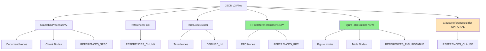

# KG_builder Enhancement Plan

## Overview
Enhancement plan to add missing reference types from JSON v2 structure to KG_builder.ipynb while maintaining simplicity and avoiding over-engineering.

## Current Coverage Analysis

### ✅ Already Implemented (80% of use cases)
1. **Document nodes** - Full metadata from JSON
2. **Chunk nodes** - With content_metadata (word_count, complexity_score, key_terms)
3. **CONTAINS relationships** - Document → Chunk
4. **REFERENCES_SPEC** - External cross-spec references
5. **REFERENCES_CHUNK** - Internal same-spec references (via ReferencesFixer)
6. **Term nodes** - Abbreviation/definition extraction (via TermNodeBuilder)
7. **DEFINED_IN relationships** - Term → Document

### ❌ Missing Features (20% - from JSON v2 data)
1. **IETF RFC references** (`cross_references.ietf_rfcs`)
2. **Figure references** (`cross_references.figures`)
3. **Table references** (`cross_references.tables`)
4. **Clause references** (`cross_references.clauses`)
5. **Semantic relationships** (SEMANTICALLY_RELATED - not in JSON, computed)
6. **Concept nodes** (key_terms aggregation - not in JSON, computed)

## JSON v2 Structure Reference

```json
{
  "cross_references": {
    "internal": [],      // ✅ Handled by ReferencesFixer
    "external": [],      // ✅ Handled by SimpleKGProcessorV2
    "ietf_rfcs": [],     // ❌ Available but not processed
    "figures": [],       // ❌ Available but not processed
    "tables": [],        // ❌ Available but not processed
    "clauses": []        // ❌ Available but not processed
  }
}
```

## Enhancement Phases

### Phase 1: Core References (High Priority)
Add missing reference types that are already in JSON v2.

#### 1.1 IETF RFC References
**Why needed**: 3GPP specs heavily reference IETF RFCs (HTTP/2, TCP, TLS, etc.)

**Implementation**:
```python
class RFCReferenceBuilder:
    """Add IETF RFC references to knowledge graph"""

    def create_rfc_nodes_and_relationships(self):
        """
        - Create RFC nodes with rfc_number
        - Create REFERENCES_RFC relationship from Chunk to RFC
        - Store context where RFC is mentioned
        """
```

**Graph Structure**:
```
(Chunk)-[:REFERENCES_RFC {context, confidence}]->(RFC {rfc_number, title})
```

**Use case**: "Find all specs that reference RFC 7540 (HTTP/2)"

#### 1.2 Figure References
**Why needed**: Enable visual context lookup and figure-to-spec mapping

**Implementation**:
```python
class FigureReferenceBuilder:
    """Add figure references to knowledge graph"""

    def create_figure_nodes_and_relationships(self):
        """
        - Create Figure nodes with figure_id
        - Create REFERENCES_FIGURE relationship from Chunk to Figure
        - Store figure context and title
        """
```

**Graph Structure**:
```
(Chunk)-[:REFERENCES_FIGURE {context, confidence}]->(Figure {figure_id, title, spec_id})
```

**Use case**: "Find chunks that reference Figure 4.2.3-1 in TS 23.501"

#### 1.3 Table References
**Why needed**: Tables contain structured data (parameters, procedures, messages)

**Implementation**:
```python
class TableReferenceBuilder:
    """Add table references to knowledge graph"""

    def create_table_nodes_and_relationships(self):
        """
        - Create Table nodes with table_id
        - Create REFERENCES_TABLE relationship from Chunk to Table
        - Store table context and title
        """
```

**Graph Structure**:
```
(Chunk)-[:REFERENCES_TABLE {context, confidence}]->(Table {table_id, title, spec_id})
```

**Use case**: "Find all references to Table 5.2.1-1 across specs"

#### 1.4 Clause References
**Why needed**: Track cross-references to specific clauses within specs

**Implementation**:
```python
class ClauseReferenceBuilder:
    """Add clause references to knowledge graph"""

    def create_clause_relationships(self):
        """
        - Create REFERENCES_CLAUSE relationship between Chunks
        - Store clause_id, context, confidence
        """
```

**Graph Structure**:
```
(Chunk)-[:REFERENCES_CLAUSE {clause_id, context, confidence}]->(Chunk)
```

**Use case**: "Find all cross-references to clause 5.2.3"

### Phase 2: Computed Features (Optional - Lower Priority)
Features not in JSON v2, need to be computed.

#### 2.1 Semantic Relationships
**Why needed**: Find related content by key terms similarity

**Implementation**:
```python
class SemanticAnalyzer:
    """Compute semantic relationships between chunks"""

    def create_semantic_relationships(self):
        """
        - Calculate Jaccard similarity from key_terms
        - Create SEMANTICALLY_RELATED if similarity > threshold
        - Store common_terms and jaccard_similarity score
        """
```

**Graph Structure**:
```
(Chunk)-[:SEMANTICALLY_RELATED {common_terms, jaccard_similarity}]-(Chunk)
```

**Trade-off**:
- ✅ Enables discovery of related content
- ❌ Computationally expensive (N² comparisons)
- ❌ Creates many relationships (graph bloat)

**Recommendation**: Only implement if needed for specific use cases

#### 2.2 Concept Nodes
**Why needed**: Aggregate and categorize key terms across specs

**Implementation**:
```python
class ConceptNodeBuilder:
    """Extract and categorize key concepts"""

    def create_concept_nodes(self):
        """
        - Aggregate key_terms from all chunks
        - Categorize concepts (network_function, procedure, protocol, etc.)
        - Create HAS_CONCEPT relationship from Chunk to Concept
        """
```

**Graph Structure**:
```
(Chunk)-[:HAS_CONCEPT]->(Concept {name, category, frequency, source_specs[]})
```

**Trade-off**:
- ✅ Enables concept-based search
- ❌ Overlaps with Term nodes (abbreviations)
- ❌ Key terms may not be accurate concepts

**Recommendation**: Skip if Term nodes are sufficient

## Implementation Strategy

### Recommended Approach: **Modular Enhancement**

Add new builder classes to KG_builder.ipynb following existing pattern:

```python
# Current structure
1. SimpleKGProcessorV2 - Core KG builder
2. ReferencesFixer - Internal references
3. TermNodeBuilder - Abbreviations/definitions

# Enhanced structure (add these)
4. RFCReferenceBuilder - RFC references
5. FigureTableBuilder - Figures & Tables references
6. ClauseReferenceBuilder - Clause references (optional)
```

### Code Structure Pattern

Each builder class follows this pattern:
```python
class NewFeatureBuilder:
    def __init__(self, neo4j_uri, neo4j_user, neo4j_password):
        self.driver = GraphDatabase.driver(...)

    def close(self):
        self.driver.close()

    def load_data_from_json(self, json_dir):
        """Extract relevant data from JSON files"""
        pass

    def create_nodes_and_relationships(self):
        """Create Neo4j nodes and relationships"""
        pass

    def verify_creation(self):
        """Verify nodes/relationships were created"""
        pass

    def build(self, json_dir):
        """Main entry point"""
        self.load_data_from_json(json_dir)
        self.create_nodes_and_relationships()
        return self.verify_creation()
```

## Workflow Diagram



## Priority Recommendation

### Phase 1A: Essential (Implement Now)
1. **RFCReferenceBuilder** - RFC references are common and valuable
2. **FigureTableBuilder** - Combined builder for Figures & Tables

### Phase 1B: Useful (Implement if needed)
3. **ClauseReferenceBuilder** - May overlap with REFERENCES_CHUNK

### Phase 2: Optional (Implement only if use case demands)
4. **SemanticAnalyzer** - Computationally expensive
5. **ConceptNodeBuilder** - Overlaps with Term nodes

## Implementation Checklist

### For each new builder:
- [ ] Create new class following the pattern
- [ ] Add constraint/index creation for new node types
- [ ] Handle null/missing data safely (avoid null property issues)
- [ ] Add verification method to check creation success
- [ ] Update statistics reporting
- [ ] Add example queries to demonstrate usage
- [ ] Update CLAUDE.md documentation
- [ ] Add unit tests in tests/ folder

## Testing Strategy

After adding each builder:
1. **Unit test** - Test each builder in isolation
2. **Integration test** - Test with full KG pipeline
3. **Query test** - Verify new relationships are queryable
4. **Performance test** - Check build time impact

## Expected Impact

### Before Enhancement:
- Nodes: Document (269), Chunk (~38K), Term (~1K)
- Relationships: CONTAINS, REFERENCES_SPEC, REFERENCES_CHUNK, DEFINED_IN
- Build time: ~10-12 minutes

### After Phase 1A Enhancement:
- Nodes: +RFC (~50-100), +Figure (~500-1K), +Table (~500-1K)
- Relationships: +REFERENCES_RFC, +REFERENCES_FIGURE, +REFERENCES_TABLE
- Build time: ~15-18 minutes (estimated)

## Migration Path

### Non-breaking changes:
- New builders are **additive only**
- Existing KG structure unchanged
- Can run incrementally on existing KG
- Can skip optional builders

### Backward compatibility:
- RAG system doesn't need changes
- Existing queries continue to work
- New queries can leverage new relationships

## Success Criteria

Enhancement is successful if:
1. ✅ All JSON v2 reference data is utilized
2. ✅ Build process remains simple and maintainable
3. ✅ No null property errors introduced
4. ✅ Query performance not significantly degraded
5. ✅ RAG system can leverage new relationships
6. ✅ Documentation is updated

## Next Steps

1. **Review this plan** - Get approval on scope
2. **Implement Phase 1A** - RFCReferenceBuilder + FigureTableBuilder
3. **Test thoroughly** - Unit + integration tests
4. **Update RAG queries** - Leverage new relationships in CypherQueryGenerator
5. **Document changes** - Update CLAUDE.md and create implementation notes
6. **Evaluate Phase 1B/2** - Decide based on actual usage patterns

## Notes

- Keep it simple: Don't add features that won't be used
- Test incrementally: Add one builder at a time
- Monitor performance: Watch build time and query speed
- Maintain consistency: Follow existing code patterns
- Document everything: Future developers will thank you
