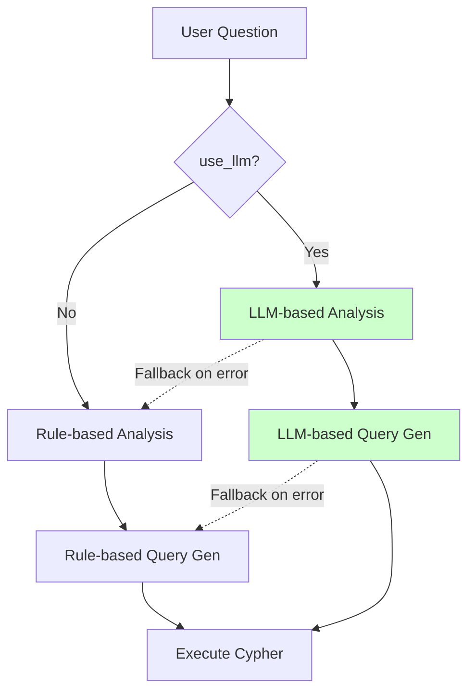

# LocalLM Query Generation Integration

## Overview

Added support for using LocalLM (Ollama) to analyze questions and generate Cypher queries dynamically, as an alternative to the rule-based approach.

## Implementation

### New Methods in CypherQueryGenerator

**File**: [`rag_system_v2.py:380-608`](../rag_system_v2.py#L380-L608)

#### 1. `_get_kg_schema()` (line 380-420)
Gets KG schema description for LLM context, including:
- Node types (Document, Chunk, Term)
- Properties for each node type
- Relationships (CONTAINS, REFERENCES_SPEC, REFERENCES_CHUNK, DEFINED_IN)
- Sample terms from loaded KG

#### 2. `_call_local_llm()` (line 422-436)
Wrapper for calling local Ollama LLM with JSON payload.

#### 3. `analyze_question_with_llm()` (line 438-496)
LLM-based question analysis:
- Sends KG schema + question to LLM
- Returns JSON with question_type, entities, key_terms, complexity, focus
- Falls back to rule-based if LLM fails

#### 4. `generate_cypher_with_llm()` (line 498-608)
LLM-based Cypher query generation:
- Provides KG schema and Cypher examples to LLM
- Generates query tailored to current question and analysis
- Falls back to rule-based if LLM fails

### Updated Methods

#### `analyze_question()` (line 610)
Added `use_llm` and `llm_model` parameters:
```python
def analyze_question(self, question: str, use_llm: bool = False, llm_model: str = "deepseek-r1:7b")
```

#### `generate_cypher_query()` (line 723)
Added `use_llm` and `llm_model` parameters:
```python
def generate_cypher_query(self, question: str, analysis: Dict, use_llm: bool = False, llm_model: str = "deepseek-r1:7b")
```

### Updated Classes

#### EnhancedKnowledgeRetriever
- Constructor now accepts `local_llm_url` parameter
- `retrieve_with_cypher()` accepts `use_llm` and `llm_model` parameters

#### RAGOrchestratorV2
- `query()` method accepts `use_llm_query` and `query_llm_model` parameters

## Workflow



## Usage Examples

### Rule-based (Default)
```python
from rag_system_v2 import create_rag_system_v2

rag = create_rag_system_v2()
response = rag.query("What is the difference between SCP and SEPP?")
```

### LLM-based Query Generation
```python
from rag_system_v2 import create_rag_system_v2

rag = create_rag_system_v2(deepseek_api_url="http://192.168.1.14:11434/api/chat")

# Use LocalLM for query analysis and generation
response = rag.query(
    "What is the difference between SCP and SEPP?",
    model="deepseek-r1:7b",  # LLM for answer generation
    use_llm_query=True,       # Use LLM for query generation
    query_llm_model="deepseek-r1:7b"  # Model for query generation
)
```

### Direct Generator Usage
```python
from rag_system_v2 import CypherQueryGenerator
from neo4j import GraphDatabase

driver = GraphDatabase.driver("neo4j://localhost:7687", auth=("neo4j", "password"))
generator = CypherQueryGenerator(neo4j_driver=driver, local_llm_url="http://192.168.1.14:11434/api/chat")

# LLM-based analysis
analysis = generator.analyze_question("What is AMF?", use_llm=True)

# LLM-based query generation
query = generator.generate_cypher_query("What is AMF?", analysis, use_llm=True)
```

## Test Results

Test script: [`test_llm_query.py`](../test_llm_query.py)

### SCP vs SEPP Question

**Rule-based**:
- question_type: comparison ✓
- entities: SCP (concept), SEPP (network_function) ✓
- complexity: medium ✓

**LLM-based**:
- question_type: comparison ✓
- entities: SCP (network_function), SEPP (network_function) ✓
- complexity: medium ✓

Both methods correctly identify the comparison question and extract both entities.

## Benefits

| Feature | Rule-based | LLM-based |
|---------|-----------|-----------|
| Speed | Fast (~ms) | Slower (~seconds) |
| Accuracy | Fixed patterns | Adaptive to context |
| Entity types | Inferred from full_name | LLM-inferred |
| Query flexibility | Template-based | Dynamic |
| New question types | Requires code | LLM handles |

## Fallback Behavior

LLM-based methods automatically fall back to rule-based if:
- LLM connection fails
- Response parsing fails
- Generated query is invalid

This ensures system stability even when LocalLM is unavailable.

## Configuration

### Environment Variables
```bash
DEEPSEEK_API_URL=http://192.168.1.14:11434/api/chat
```

### Default Model
The default LLM model is `deepseek-r1:7b` for query generation. Can be changed via parameters.

## Files Modified

- [`rag_system_v2.py`](../rag_system_v2.py) - Core implementation
- [`test_llm_query.py`](../test_llm_query.py) - Test script (created)

## Next Steps

1. **Optimize LLM prompts** - Fine-tune prompts for better accuracy
2. **Add caching** - Cache LLM responses for repeated questions
3. **Parallel execution** - Run rule-based and LLM-based in parallel, use best result
4. **Hybrid mode** - Use LLM to validate/improve rule-based queries
