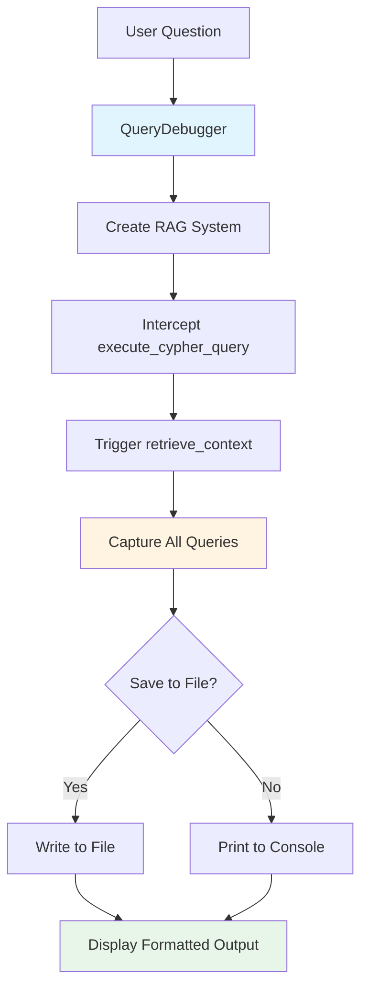

# Query Debugging Script

Debug script to extract and analyze all Cypher queries generated by the RAG system for any given question.

## Purpose

When debugging RAG system behavior, you need to see exactly what Cypher queries are being generated and executed against Neo4j. This script intercepts query execution and captures all queries with their parameters.

## Workflow



## Usage

### Basic Usage

```bash
# Activate virtual environment first
source .venv/bin/activate

# Extract queries for a question
python debug_query_extraction.py "What is the difference between SCP and SEPP?"

# Save to auto-generated file
python debug_query_extraction.py "What is AMF?" --save-to-file

# Save to specific file
python debug_query_extraction.py "What is AMF?" --output my_queries.txt
```

### With Custom API Keys

```bash
python debug_query_extraction.py "What is AMF?" \
  --claude-key "sk-ant-..." \
  --deepseek-url "http://localhost:11434/api/chat"
```

## Output Format

The script provides two formats for each query:

1. **Original Query with Parameters** - Shows the parameterized query
2. **Ready for Neo4j Browser** - Parameters substituted, ready to paste

Example output:

```
================================================================================
EXTRACTED 3 CYPHER QUERIES
================================================================================

Query #1: Term Lookup
--------------------------------------------------------------------------------

// Original Query (with parameters):
MATCH (t:Term {abbreviation: $term})
RETURN t.full_name, t.abbreviation

// Parameters:
//   $term = SCP

// Ready for Neo4j Browser (parameters substituted):
MATCH (t:Term {abbreviation: 'SCP'})
RETURN t.full_name, t.abbreviation

================================================================================

Query #2: Content Search
--------------------------------------------------------------------------------

// Original Query (with parameters):
MATCH (c:Chunk)
WHERE c.content CONTAINS $search_term
RETURN c.content, c.chunk_id LIMIT 10

// Parameters:
//   $search_term = Service Communication Proxy

// Ready for Neo4j Browser (parameters substituted):
MATCH (c:Chunk)
WHERE c.content CONTAINS 'Service Communication Proxy'
RETURN c.content, c.chunk_id LIMIT 10

================================================================================
```

## Query Type Identification

The script automatically identifies query types:

- **Term Lookup** - Queries searching Term nodes by abbreviation
- **Content Search** - Queries searching Chunk content
- **Reference Traversal** - Queries using REFERENCES_CHUNK relationships
- **Document Metadata** - Queries on Document nodes
- **Custom Query** - Other query types

## Implementation Details

### Query Interception

The script uses method interception to capture queries:

```python
# Store original method
self._original_execute = self.rag.knowledge_retriever.execute_cypher_query

# Replace with interceptor
def intercept_execute(cypher_query: str, parameters: dict = None):
    # Capture query and parameters
    queries.append({'query': cypher_query, 'parameters': parameters})
    # Call original method
    return self._original_execute(cypher_query, parameters)

# Temporarily replace
self.rag.knowledge_retriever.execute_cypher_query = intercept_execute
```

### Parameter Substitution

Parameters are substituted based on type:

- **String** → Wrapped in single quotes
- **Number** → Raw value
- **List** → JSON format with double quotes
- **Other** → String representation

## Use Cases

### 1. Debugging Wrong Results

```bash
# Question returns unexpected results
python debug_query_extraction.py "What is AMF?" --save-to-file

# Review generated queries
# Test each query in Neo4j browser
# Identify which query returns wrong data
```

### 2. Performance Analysis

```bash
# Extract queries
python debug_query_extraction.py "Compare AMF and SMF" --output perf_test.txt

# Copy queries to Neo4j browser
# Run PROFILE or EXPLAIN on each query
# Optimize slow queries
```

### 3. Testing Query Generation Logic

```bash
# Test different question types
python debug_query_extraction.py "What is AMF?"          # Definition
python debug_query_extraction.py "Compare AMF and SMF"   # Comparison
python debug_query_extraction.py "How does AMF work?"    # Procedure
python debug_query_extraction.py "Where is AMF defined?" # Reference

# Verify correct query patterns are used
```

### 4. Regression Testing

```bash
# Before changing query generation logic
python debug_query_extraction.py "What is SCP?" --output baseline.txt

# After changes
python debug_query_extraction.py "What is SCP?" --output modified.txt

# Compare files
diff baseline.txt modified.txt
```

## Integration with RAG System

The script uses the actual `rag_system_v2.py` components:

- `CypherQueryGenerator` - Generates queries based on question type
- `EnhancedKnowledgeRetriever` - Executes queries against Neo4j
- Same query generation logic as production

This ensures queries captured are identical to what the chatbot uses.

## Limitations

1. **Read-Only** - Script only captures queries, doesn't modify Neo4j
2. **Context Only** - Captures queries from `retrieve_context()`, not final LLM response
3. **No Caching** - Every run executes fresh queries (may be slow)

## Environment Requirements

- `.env` file with API keys (or pass via command line)
- Neo4j running with populated knowledge graph
- Virtual environment activated
- All dependencies installed

## Tips

### Quick Test Workflow

```bash
# 1. Extract queries
python debug_query_extraction.py "What is AMF?" --save-to-file

# 2. Open Neo4j browser (http://localhost:7474)

# 3. Copy "Ready for Neo4j Browser" queries from output

# 4. Paste and run in Neo4j browser

# 5. Verify results match expectations
```

### Debugging Complex Questions

For multi-part questions, the script shows the query sequence:

```bash
python debug_query_extraction.py "What is the difference between SCP and SEPP?"
```

This reveals:
1. Term lookups for both SCP and SEPP
2. Content searches for full names
3. Comparison logic queries

### Finding Missing Data

If queries return empty results:

```bash
# Extract queries
python debug_query_extraction.py "What is XYZ?" --output check.txt

# Run queries in Neo4j browser
# Check if Term nodes exist
# Check if content chunks exist
# Verify relationships are present
```

## Related Files

- [`rag_system_v2.py`](../rag_system_v2.py) - RAG system implementation
- [`cypher_sanitizer.py`](../cypher_sanitizer.py) - Query sanitization
- [`logging_config.py`](../logging_config.py) - Logging configuration
- [`.env.example`](../.env.example) - Environment variable template

## Changelog

- 2025-12-07: Initial version created for debugging query generation
