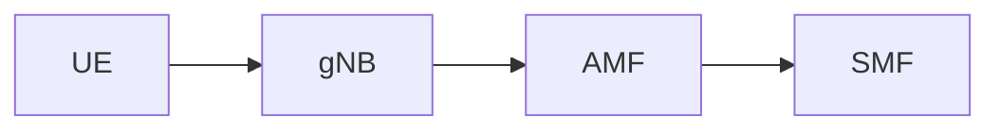

# UI Markdown Rendering

## Overview

Updated the chat UI to render bot responses as Markdown with support for:
- Formatted text (bold, italic, headings)
- Code blocks with syntax highlighting
- Tables
- Lists (ordered and unordered)
- Mermaid diagrams

## Libraries Added

| Library | Version | Purpose |
|---------|---------|---------|
| marked.js | latest | Markdown parsing |
| highlight.js | 11.9.0 | Code syntax highlighting |
| mermaid.js | 10.x | Diagram rendering |

## Files Modified

### chat.html
- Added CDN links for marked.js, highlight.js, mermaid.js
- Added CSS styles for Markdown elements
- Updated `addMessage()` function to render Markdown for bot messages
- Added `renderMermaidDiagrams()` function for diagram support
- Made `sendMessage()` async to handle Mermaid rendering

### rag_system_v2.py
- Updated prompts for both Claude API and local LLM
- Added instructions to format responses in Markdown
- Added instructions to use Mermaid diagrams for complex relationships
- Added requirement for "Sources" section with spec references

## Markdown Features Supported

### Text Formatting
- **Bold** text for key terms
- *Italic* for emphasis
- `Code` for technical identifiers
- Headings (##, ###)

### Lists
- Bullet points for features/descriptions
- Numbered lists for procedures/steps

### Code Blocks
```python
# Syntax highlighted code
def example():
    pass
```

### Tables
| Column 1 | Column 2 |
|----------|----------|
| Data     | Data     |

### Mermaid Diagrams


## Usage Example

When user asks "What is SCP?", the response will be formatted like:

```markdown
## Service Communication Proxy (SCP)

The **SCP** (Service Communication Proxy) is a network function in the 5G Core that:

- Acts as an **intermediary** between NF service consumers and producers
- Provides **load balancing** across NF instances
- Handles **service discovery** delegation from NRF

### Key Functions
1. Message routing
2. Load distribution
3. Connection management

## Sources
- TS 23.501 Section 6.2.x
- TS 29.500 Section 5.x
```

## CSS Styling

Key styles added:
- `.bot-message h1/h2/h3` - Heading styles
- `.bot-message code` - Inline code styling
- `.bot-message pre` - Code block styling
- `.bot-message table` - Table styling
- `.mermaid` - Diagram container styling

## Notes

- User messages remain plain text (not rendered as Markdown)
- Mermaid diagrams are rendered asynchronously after message is added to DOM
- Syntax highlighting uses GitHub theme from highlight.js
- Large diagrams may need scrolling (max-width: 100%)
- Using marked.js extension API for Mermaid (not deprecated renderer override)
