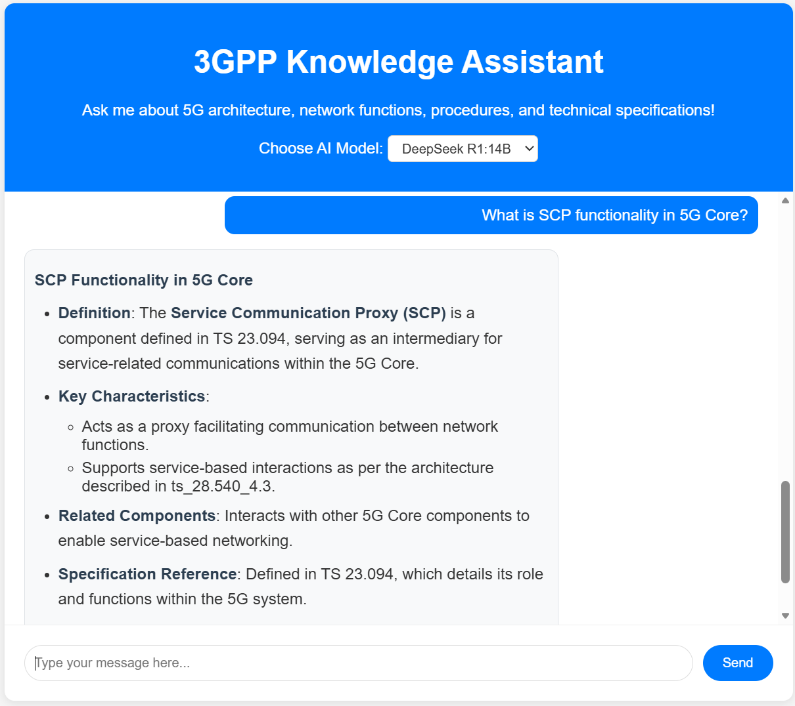
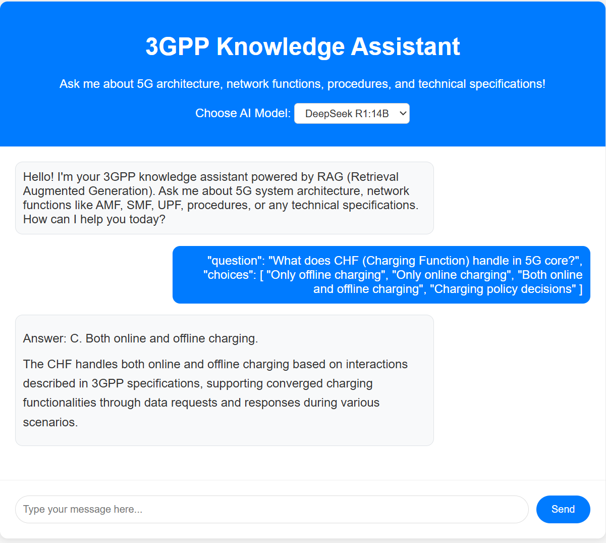
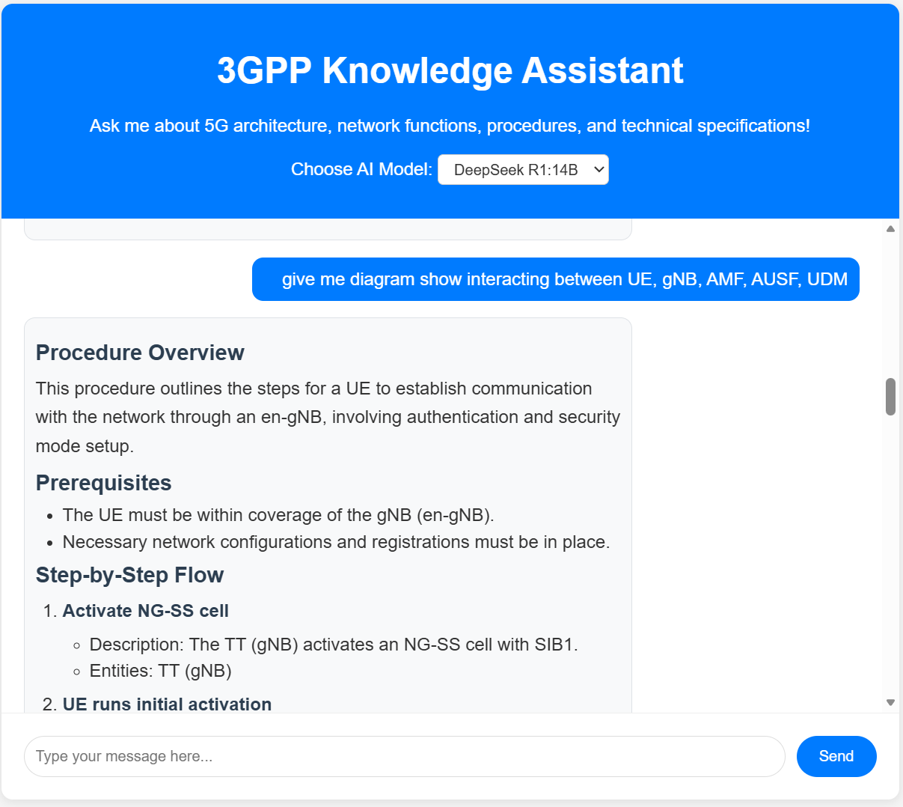
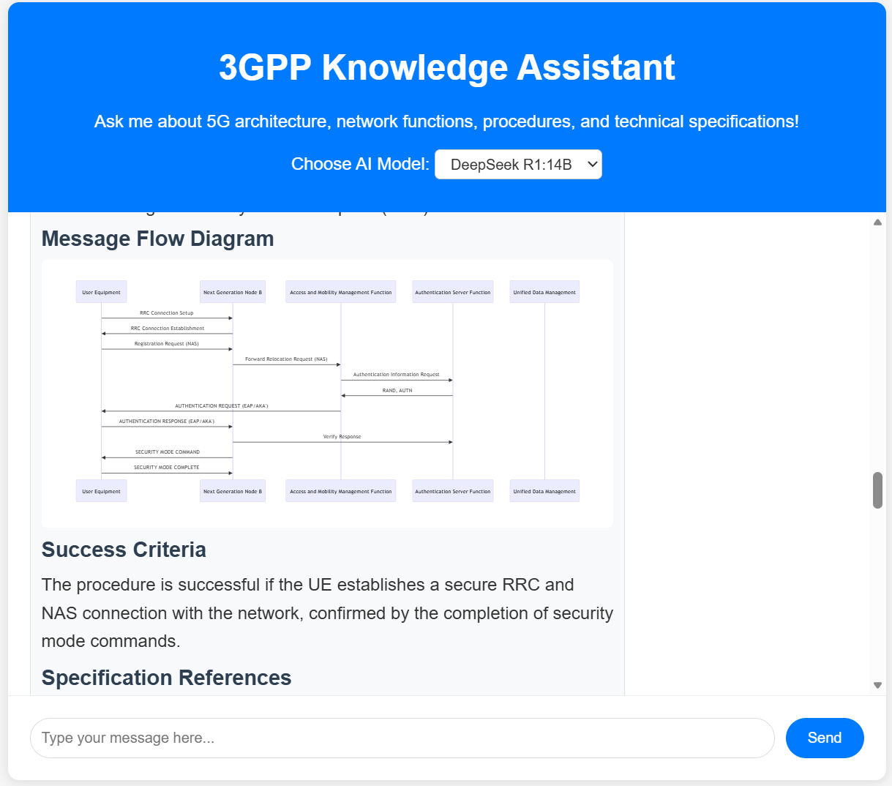
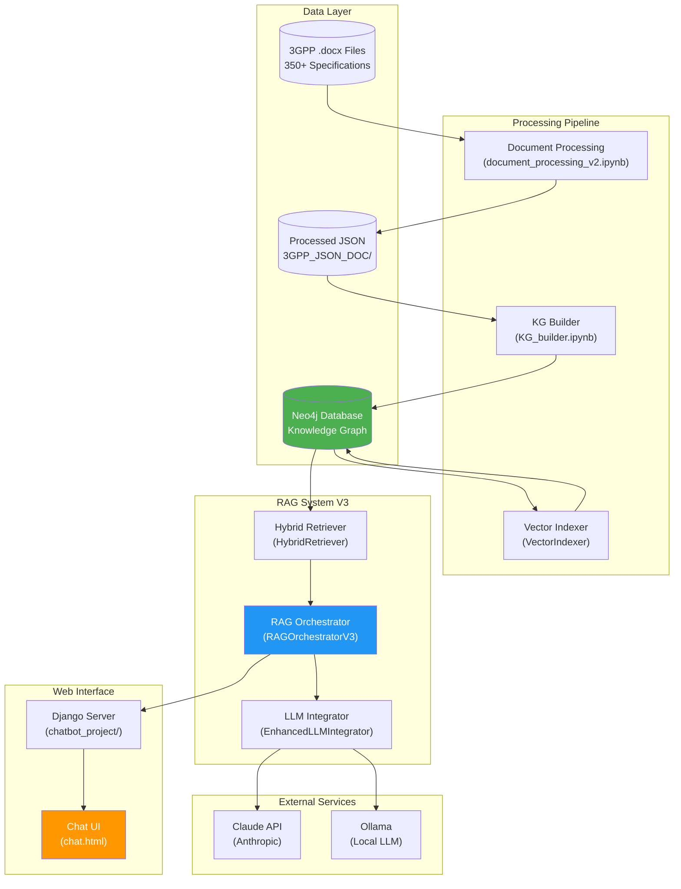
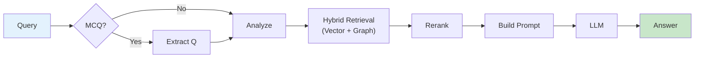
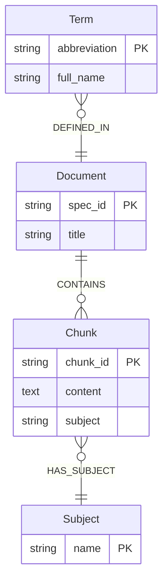

# 3GPP Knowledge Graph & RAG System

AI-powered Q&A system for 3GPP 5G/telecom technical specifications. Combines Knowledge Graph (Neo4j) with RAG (Retrieval-Augmented Generation) for accurate technical answers.

## Features

- **350+ 3GPP Specifications** - Processed and indexed for instant retrieval
- **Knowledge Graph** - Neo4j graph database with Document, Chunk, Term, and Subject nodes
- **Hybrid Retrieval (V3)** - Vector search + Graph search + Subject-aware boosting
- **MCQ Support** - Automatic detection and processing of Multiple Choice Questions
- **Multi-LLM Support** - Claude API + Local models via Ollama (DeepSeek, Llama, etc.)
- **Web Interface** - Django-based chat UI with conversation history

## Demo

<table>
<tr>
<td width="50%">

**Definition Query**



</td>
<td width="50%">

**Multiple Choice Question**



</td>
</tr>
<tr>
<td width="50%">

**Procedure Query**



</td>
<td width="50%">

**Sequence Diagram Generation**



</td>
</tr>
</table>

---

## Quick Start

### Prerequisites

- Python 3.10+
- Docker (for Neo4j)
- API keys (optional): Claude API key for Claude model

### Installation

```bash
# Clone repository
git clone <repo-url>
cd 3GPP

# Create virtual environment
python -m venv .venv
source .venv/bin/activate

# Install dependencies
pip install -r requirements.txt

# Setup environment
cp .env.example .env
# Edit .env with your API keys
```

### Run Everything (Recommended)

```bash
# Start all services: Neo4j, Knowledge Graph, ngrok, Django
python orchestrator.py all

# Or with forced KG re-initialization
python orchestrator.py all --init-kg
```

### Manual Setup

```bash
# 1. Start Neo4j
python orchestrator.py start-neo4j

# 2. Initialize Knowledge Graph + Vector Search (10-30 min)
python orchestrator.py init-kg

# 3. Start Django server
python orchestrator.py run
```

Access the chat interface at `http://localhost:9999`

---

## Benchmark Results

[Benchmark Data](tests/benchmark/tele_qna_benchmark_comprehensive.json) with 95 diverse telecom questions.

**Overall: 84.21% (80/95 correct) | Avg Response Time: 14.0s | Model: deepseek-r1:14b**

| Category | Questions | Correct | Accuracy | Avg Time |
|----------|:---------:|:-------:|:--------:|:--------:|
| Use Case/Application | 10 | 10 | **100%** | 11.3s |
| Network Function | 11 | 11 | **100%** | 12.4s |
| Definition | 13 | 12 | **92.31%** | 11.9s |
| Policy & QoS | 10 | 9 | **90%** | 10.5s |
| Procedure | 11 | 9 | 81.82% | 22.1s |
| Technical Detail | 10 | 8 | 80% | 19.0s |
| Security | 10 | 8 | 80% | 13.2s |
| Comparison | 10 | 7 | 70% | 12.6s |
| Architecture | 10 | 6 | 60% | 13.3s |

---

## System Architecture



For detailed component diagrams, see [architecture.md](.md/architecture.md).

---

## RAG Query Processing



**Pipeline Stages:**
1. **MCQ Detection** - Extract question-only for retrieval
2. **Query Analysis** - Intent, entities, term resolution
3. **Hybrid Retrieval** - Vector search + Graph search + Subject boost
4. **Result Processing** - Merge, deduplicate, rerank
5. **Prompt Building** - Intent-specific template selection
6. **LLM Generation** - Claude API or Ollama

---

## Knowledge Graph Schema



**4 Node Types:** Document (350+), Chunk (15k+), Term (16k+), Subject (5)

**5 Relationships:** CONTAINS, DEFINED_IN, REFERENCES_CHUNK, REFERENCES_SPEC, HAS_SUBJECT

---

## Question Types & Retrieval Strategies

| Type | Example | Strategy |
|------|---------|----------|
| Definition | "What is AMF?" | Term resolution + Vector search |
| Comparison | "Compare AMF and SMF" | Multi-step retrieval for both entities |
| Procedure | "How does UE registration work?" | Procedure-focused graph query |
| Network Function | "What is the role of PCF?" | Function/role content search |
| Relationship | "How do AMF and SMF interact?" | Multi-entity content search |
| Multiple Choice | MCQ with A/B/C/D options | Question-only retrieval + MCQ prompt |

---

## Usage

### Python API

```python
from rag_system_v3 import create_rag_system_v3

rag = create_rag_system_v3(
    claude_api_key="sk-...",
    local_llm_url="http://localhost:11434/api/chat"
)

# First time: setup vector search
rag.setup_vector_search()

response = rag.query(
    "Compare AMF and SMF",
    model="deepseek-r1:14b",
    use_hybrid=True
)
print(response.answer)
print(f"Strategy: {response.retrieval_strategy}")
```

### Orchestrator Commands

| Command | Description |
|---------|-------------|
| `check` | Check system status (Neo4j, KG, V3 readiness) |
| `start-neo4j` | Start Neo4j Docker container |
| `init-kg` | Initialize KG + setup vector search |
| `init-kg --skip-vector` | Initialize KG only |
| `run` | Start Django server |
| `all` | Start everything |
| `stop` | Stop all services |

### LLM Models

**API-Based:** Claude (Anthropic) - `model="claude"`

**Local (Ollama):** DeepSeek (`deepseek-r1:14b`), Llama (`llama3.1:8b`), Mistral (`mistral:7b`), Gemma (`gemma3:12b`)

---

## Project Structure

```
3GPP/
├── orchestrator.py              # System orchestrator (start/stop/init)
├── rag_system_v3.py             # RAG V3 orchestrator (main entry point)
├── hybrid_retriever.py          # Vector + Graph + Subject-aware retrieval
├── prompt_templates.py          # Intent-specific prompts (7 types)
├── subject_classifier.py        # Subject classification for chunks/queries
│
├── chatbot_project/             # Django web application
│   └── chatbot/views.py         # API endpoints & RAGManager
│
├── KG_builder.ipynb             # Knowledge Graph builder notebook
├── document_processing/         # Document processing pipeline
├── 3GPP_JSON_DOC/              # Processed JSON files
├── tests/                       # Test suite (pytest)
└── .md/                         # Documentation folder
```

---

## Configuration

### Environment Variables

```bash
# Required for Claude model
CLAUDE_API_KEY="your-anthropic-api-key"

# Optional (defaults shown)
NEO4J_URI="neo4j://localhost:7687"
NEO4J_USER="neo4j"
NEO4J_PASSWORD="password"
LOCAL_LLM_URL="http://localhost:11434/api/chat"
```

### Logging

5 custom log levels: `CRITICAL > ERROR > MAJOR > MINOR > DEBUG`

Log files: `logs/app.log` (rotates on startup and when >1GB)

---

## Testing & Benchmarks

```bash
# Run all tests
pytest tests/ -v

# Run with coverage
pytest tests/ --cov=. --cov-report=term-missing

# Run benchmark
python tests/benchmark/run_tele_qna_benchmark.py
```

---

## Documentation

See `.md/` folder for detailed documentation:

| Document | Description |
|----------|-------------|
| [architecture.md](.md/architecture.md) | Detailed component diagrams |
| [enhance/rag_system_v3_implementation.md](.md/enhance/rag_system_v3_implementation.md) | V3 implementation |
| [enhance/subject_based_kg_enhancement.md](.md/enhance/subject_based_kg_enhancement.md) | Subject classification |
| [mcq_retrieval_fix_20251210.md](.md/mcq_retrieval_fix_20251210.md) | MCQ processing |

---

## Recent Changes

### 2025-12-11
- Documentation restructure: Detailed diagrams moved to [architecture.md](.md/architecture.md)
- Debug script: `debug_query_pipeline.py` for tracing query processing
- Diagram verification: All diagrams verified against code implementation

### 2025-12-10
- MCQ Retrieval Fix: Question-only retrieval for MCQ
- Benchmark Accuracy: Improved from 30.53% to 84.21%
- Subject-Based Retrieval: Chunks classified by subject type
