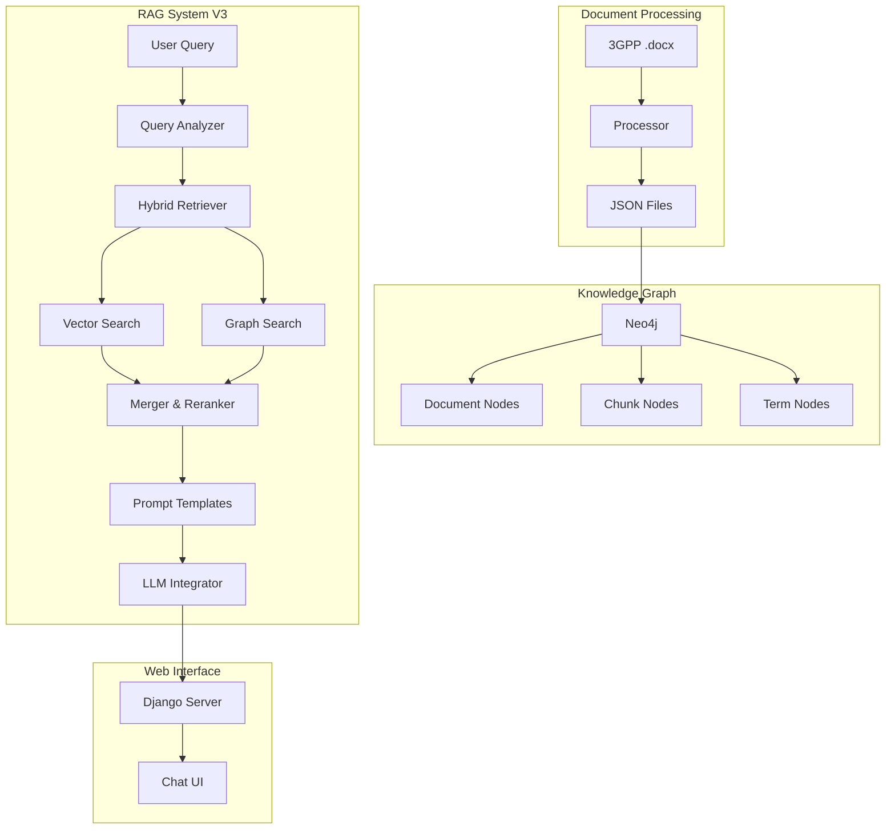

# 3GPP Knowledge Graph & RAG System

AI-powered Q&A system for 3GPP 5G/telecom technical specifications. Combines Knowledge Graph (Neo4j) with RAG (Retrieval-Augmented Generation) for accurate technical answers.

## Features

- **350+ 3GPP Specifications** - Processed and indexed for instant retrieval
- **Knowledge Graph** - Neo4j graph database with Document, Chunk, and Term nodes
- **Hybrid Retrieval (V3)** - Vector search + Graph search for better accuracy
- **Enhanced Query Processing** - 10 intent categories with intelligent strategy selection
- **Multi-LLM Support** - Claude API + Local models via Ollama (DeepSeek, Llama, etc.)
- **Web Interface** - Django-based chat UI with conversation history
- **Comprehensive Testing** - 196 tests with 100% pass rate

## Architecture

```
3GPP Docs (.docx) → Document Processing → JSON → Neo4j KG → RAG System → LLM → Chat UI
```



## Quick Start

### Prerequisites

- Python 3.10+
- Docker (for Neo4j)
- API keys (optional): Claude API key for Claude model

### Installation

```bash
# Clone repository
git clone <repo-url>
cd 3GPP

# Create virtual environment
python -m venv .venv
source .venv/bin/activate

# Install dependencies
pip install -r requirements.txt

# Setup environment
cp .env.example .env
# Edit .env with your API keys
```

### Run Everything (Recommended)

```bash
# Start all services: Neo4j, Knowledge Graph, ngrok, Django
python orchestrator.py all

# Or with forced KG re-initialization
python orchestrator.py all --init-kg
```

### Manual Setup

```bash
# 1. Start Neo4j
python orchestrator.py start-neo4j

# 2. Initialize Knowledge Graph
python orchestrator.py init-kg

# 3. (Optional) Setup Vector Search for V3
python orchestrator.py setup-v3

# 4. Start Django server
python orchestrator.py run
```

Access the chat interface at `http://localhost:8000`

## Orchestrator Commands

| Command | Description |
|---------|-------------|
| `check` | Check system status (Neo4j, KG, V3 readiness) |
| `install` | Install dependencies in venv |
| `start-neo4j` | Start Neo4j Docker container |
| `init-kg` | Initialize Knowledge Graph from JSON |
| `setup-v3` | Setup Vector Search for RAG V3 |
| `run` | Start Django server |
| `ngrok` | Start ngrok tunnels |
| `all` | Start everything |
| `stop` | Stop all services |

## Project Structure

```
3GPP/
├── orchestrator.py              # System orchestrator
├── rag_system_v3.py             # RAG V3 (Hybrid) - Active
├── rag_system_v2.py             # RAG V2 (Graph-only) - Legacy
├── hybrid_retriever.py          # Vector + Graph retrieval
├── prompt_templates.py          # Intent-specific prompts (7 types)
├── enhanced_query_processor.py  # Advanced query understanding
├── cypher_sanitizer.py          # Query security
├── term_extractor.py            # Abbreviation extraction
├── logging_config.py            # Centralized logging
├── log_config.json              # Log configuration
├── .env                         # Environment variables
│
├── chatbot_project/             # Django web app
│   └── chatbot/
│       ├── views.py
│       └── templates/
│
├── document_processing/         # Document processing
│   └── document_processing_v2.ipynb
│
├── 3GPP_JSON_DOC/              # Processed JSON files
│   └── processed_json_v2/
│
├── tests/                       # Test suite (196 tests)
│   ├── test_rag_system_v3.py
│   ├── test_rag_system_v2.py
│   ├── test_hybrid_retriever.py
│   ├── test_prompt_templates.py
│   └── ...
│
├── logs/                        # Log files
└── .md/                         # Documentation
```

## RAG System Versions

### V2 (Graph-Only)

```python
from rag_system_v2 import create_rag_system_v2

rag = create_rag_system_v2(
    claude_api_key="sk-...",
    deepseek_api_url="http://localhost:11434/api/chat"
)

response = rag.query("What is AMF?", model="deepseek-r1:14b")
print(response.answer)
```

### V3 (Hybrid - Recommended)

```python
from rag_system_v3 import create_rag_system_v3

rag = create_rag_system_v3(
    claude_api_key="sk-...",
    local_llm_url="http://localhost:11434/api/chat"
)

# First time: setup vector search
rag.setup_vector_search()

response = rag.query(
    "Compare AMF and SMF",
    model="deepseek-r1:14b",
    use_hybrid=True
)
print(response.answer)
print(f"Strategy: {response.retrieval_strategy}")
```

## Question Types

| Type | Example | V3 Strategy |
|------|---------|-------------|
| Definition | "What is AMF?" | Vector-preferred |
| Comparison | "Compare AMF and SMF" | Hybrid-expanded |
| Procedure | "How does UE registration work?" | Graph-sequential |
| Reference | "What specs reference UPF?" | Graph-preferred |
| Network Function | "What is the role of PCF?" | Hybrid-balanced |
| Relationship | "How do AMF and SMF interact?" | Graph-preferred |
| Specification | "What does TS 23.501 cover?" | Graph-focused |
| Multiple Choice | TeleQnA format questions | Structured |
| Architecture | "5G core architecture" | Hybrid-expanded |
| Protocol | "NAS protocol messages" | Protocol-specific |

## LLM Models

### API-Based
- **Claude** (Anthropic): `model="claude"`

### Local (via Ollama)
- **DeepSeek**: `model="deepseek-r1:7b"` or `model="deepseek-r1:14b"`
- **Llama**: `model="llama3.2"` or `model="llama3.1:8b"`
- **Mistral**: `model="mistral:7b"`
- **Gemma**: `model="gemma3:12b"`

## Neo4j Schema

```cypher
// Nodes
(:Document {spec_id, title, version, total_chunks})
(:Chunk {chunk_id, spec_id, section_id, section_title, content, chunk_type, complexity_score, key_terms})
(:Term {abbreviation, full_name, term_type, source_specs, primary_spec})

// Relationships
(:Document)-[:CONTAINS]->(:Chunk)
(:Chunk)-[:REFERENCES_SPEC]->(:Document)
(:Chunk)-[:REFERENCES_CHUNK]->(:Chunk)
(:Term)-[:DEFINED_IN]->(:Document)
```

## Testing

```bash
# Run all tests (196 tests)
pytest tests/ -v

# Run with coverage
pytest tests/ --cov=. --cov-report=term-missing

# Run specific test file
pytest tests/test_rag_system_v3.py -v

# Run core test suite (guaranteed to pass)
pytest tests/test_cypher_sanitizer.py tests/test_logging_config.py \
       tests/test_hybrid_retriever.py tests/test_prompt_templates.py \
       tests/test_rag_system_v3.py tests/test_orchestrator_simple.py \
       tests/test_system_integration.py tests/test_rag_system_v2.py \
       tests/test_hybrid_term_extraction.py -v
```

### Test Coverage

| Test File | Tests | Status |
|-----------|-------|--------|
| test_cypher_sanitizer.py | 28 | Passed |
| test_logging_config.py | 16 | Passed |
| test_hybrid_retriever.py | 21 | Passed |
| test_prompt_templates.py | 25 | Passed |
| test_rag_system_v3.py | 20 | Passed |
| test_orchestrator_simple.py | 18 | Passed |
| test_system_integration.py | 15 | Passed |
| test_rag_system_v2.py | 35 | Passed |
| test_hybrid_term_extraction.py | 18 | Passed |
| **Total** | **196** | **100%** |

## Logging

5 custom log levels: `CRITICAL > ERROR > MAJOR > MINOR > DEBUG`

```python
from logging_config import setup_centralized_logging, get_logger, MAJOR

setup_centralized_logging()
logger = get_logger('MyComponent')
logger.log(MAJOR, "Important event occurred")
```

Log files: `logs/app.log` (rotates on startup and when >1GB)

## Environment Variables

```bash
# Required for Claude model
CLAUDE_API_KEY="your-anthropic-api-key"

# Optional (defaults shown)
NEO4J_URI="neo4j://localhost:7687"
NEO4J_USER="neo4j"
NEO4J_PASSWORD="password"
LOCAL_LLM_URL="http://localhost:11434/api/chat"
```

## Documentation

See `.md/` folder for detailed documentation:

- [project_architecture.md](.md/project_architecture.md) - System architecture
- [system_evaluation_and_enhancements.md](.md/system_evaluation_and_enhancements.md) - System evaluation report
- [rag_query_redesign.md](.md/rag_query_redesign.md) - Query system design
- [logging_system.md](.md/logging_system.md) - Logging configuration
- [enhance/rag_system_v3_implementation.md](.md/enhance/rag_system_v3_implementation.md) - V3 implementation details
- [enhance/implementation_summary.md](.md/enhance/implementation_summary.md) - Enhancement summary

## License

Private project - All rights reserved.

## Contributing

1. Create feature branch from `main`
2. Write tests for new features
3. Run test suite: `pytest tests/ -v`
4. Update documentation in `.md/` folder
5. Create pull request
