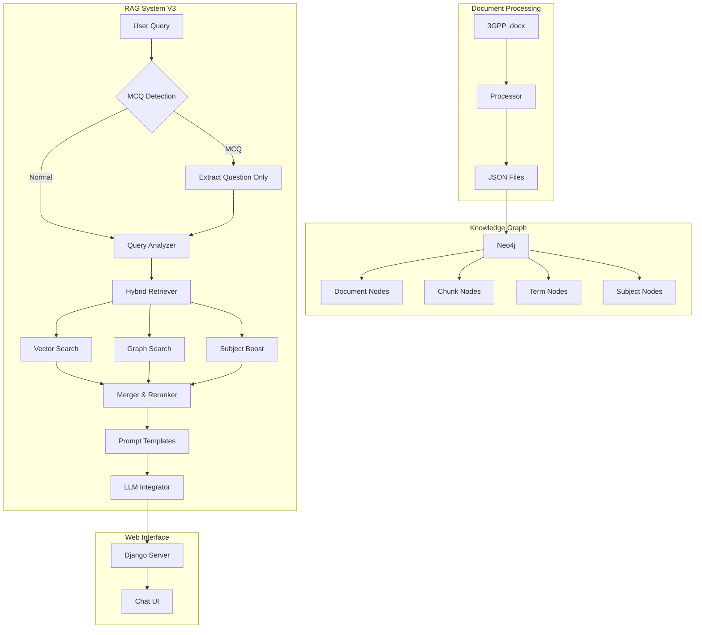

# 3GPP Knowledge Graph & RAG System

AI-powered Q&A system for 3GPP 5G/telecom technical specifications. Combines Knowledge Graph (Neo4j) with RAG (Retrieval-Augmented Generation) for accurate technical answers.

## Features

- **350+ 3GPP Specifications** - Processed and indexed for instant retrieval
- **Knowledge Graph** - Neo4j graph database with Document, Chunk, Term, and Subject nodes
- **Hybrid Retrieval (V3)** - Vector search + Graph search + Subject-aware boosting
- **MCQ Support** - Automatic detection and processing of Multiple Choice Questions
- **Multi-LLM Support** - Claude API + Local models via Ollama (DeepSeek, Llama, etc.)
- **Web Interface** - Django-based chat UI with conversation history

## Benchmark Results (2025-12-10)

| Category | Accuracy |
|----------|----------|
| Use Case/Application | **100%** |
| Network Function | **100%** |
| Definition | 92.31% |
| Policy & QoS | 90% |
| Procedure | 81.82% |
| Technical Detail | 80% |
| Security | 80% |
| Comparison | 70% |
| Architecture | 60% |
| **Overall** | **84.21%** (80/95) |

## Architecture

```
3GPP Docs (.docx) → Document Processing → JSON → Neo4j KG → RAG System → LLM → Chat UI
```



## Quick Start

### Prerequisites

- Python 3.10+
- Docker (for Neo4j)
- API keys (optional): Claude API key for Claude model

### Installation

```bash
# Clone repository
git clone <repo-url>
cd 3GPP

# Create virtual environment
python -m venv .venv
source .venv/bin/activate

# Install dependencies
pip install -r requirements.txt

# Setup environment
cp .env.example .env
# Edit .env with your API keys
```

### Run Everything (Recommended)

```bash
# Start all services: Neo4j, Knowledge Graph, ngrok, Django
python orchestrator.py all

# Or with forced KG re-initialization
python orchestrator.py all --init-kg
```

### Manual Setup

```bash
# 1. Start Neo4j
python orchestrator.py start-neo4j

# 2. Initialize Knowledge Graph + Vector Search (10-30 min)
python orchestrator.py init-kg

# 3. Start Django server
python orchestrator.py run
```

Access the chat interface at `http://localhost:8000`

## Orchestrator Commands

| Command | Description |
|---------|-------------|
| `check` | Check system status (Neo4j, KG, V3 readiness) |
| `install` | Install dependencies in venv |
| `start-neo4j` | Start Neo4j Docker container |
| `init-kg` | Initialize KG + setup vector search (10-30 min) |
| `init-kg --skip-vector` | Initialize KG only, skip vector search |
| `init-kg --vector-only` | Setup vector search only (KG exists) |
| `setup-v3` | Setup vector search only (alternative) |
| `run` | Start Django server |
| `ngrok` | Start ngrok tunnels |
| `all` | Start everything |
| `all --init-kg` | Start all + force KG re-initialization |
| `stop` | Stop all services |

## Project Structure

```
3GPP/
├── orchestrator.py              # System orchestrator
├── rag_system_v3.py             # RAG V3 (Hybrid) - Active
├── rag_core.py                  # Shared RAG components (LLM, Cypher Generator)
├── hybrid_retriever.py          # Vector + Graph + Subject-aware retrieval
├── subject_classifier.py        # Subject classification for chunks/queries
├── prompt_templates.py          # Intent-specific prompts (7 types)
├── enhanced_query_processor.py  # Advanced query understanding
├── cypher_sanitizer.py          # Query security
├── term_extractor.py            # Abbreviation extraction
├── logging_config.py            # Centralized logging
├── run_tele_qna_benchmark.py    # Benchmark runner
│
├── chatbot_project/             # Django web app
│   └── chatbot/
│       ├── views.py
│       └── templates/
│
├── document_processing/         # Document processing
│   └── document_processing_v2.ipynb
│
├── 3GPP_JSON_DOC/              # Processed JSON files
│   └── processed_json_v2/
│
├── tele_qna/                   # Benchmark Q&A data
├── tests/                       # Test suite
├── trash/                       # Removed/deprecated files
├── logs/                        # Log files
└── .md/                         # Documentation
```

## RAG System Usage

### V3 (Hybrid - Recommended)

```python
from rag_system_v3 import create_rag_system_v3

rag = create_rag_system_v3(
    claude_api_key="sk-...",
    local_llm_url="http://localhost:11434/api/chat"
)

# First time: setup vector search
rag.setup_vector_search()

response = rag.query(
    "Compare AMF and SMF",
    model="deepseek-r1:14b",
    use_hybrid=True
)
print(response.answer)
print(f"Strategy: {response.retrieval_strategy}")
```

## Question Types

| Type | Example | V3 Strategy |
|------|---------|-------------|
| Definition | "What is AMF?" | Vector-preferred |
| Comparison | "Compare AMF and SMF" | Hybrid-expanded |
| Procedure | "How does UE registration work?" | Graph-sequential |
| Reference | "What specs reference UPF?" | Graph-preferred |
| Network Function | "What is the role of PCF?" | Hybrid-balanced |
| Relationship | "How do AMF and SMF interact?" | Graph-preferred |
| Multiple Choice | MCQ with A/B/C/D options | MCQ-specific prompt |
| Architecture | "5G core architecture" | Hybrid-expanded |

## MCQ Processing

The system automatically detects MCQ format and optimizes retrieval:

1. **Detection**: Supports A./A)/inline/(A) formats and JSON choices
2. **Retrieval**: Uses question-only (without choices) to avoid noise
3. **Generation**: Full question with choices sent to LLM
4. **Extraction**: Robust answer extraction from LLM response

## LLM Models

### API-Based
- **Claude** (Anthropic): `model="claude"`

### Local (via Ollama)
- **DeepSeek**: `model="deepseek-r1:7b"` or `model="deepseek-r1:14b"`
- **Llama**: `model="llama3.2"` or `model="llama3.1:8b"`
- **Mistral**: `model="mistral:7b"`
- **Gemma**: `model="gemma3:12b"`

## Neo4j Schema

```cypher
// Nodes
(:Document {spec_id, title, version, total_chunks})
(:Chunk {chunk_id, spec_id, section_id, section_title, content, chunk_type, complexity_score, key_terms, subject})
(:Term {abbreviation, full_name, term_type, source_specs, primary_spec})
(:Subject {name})

// Relationships
(:Document)-[:CONTAINS]->(:Chunk)
(:Chunk)-[:REFERENCES_SPEC]->(:Document)
(:Chunk)-[:REFERENCES_CHUNK]->(:Chunk)
(:Term)-[:DEFINED_IN]->(:Document)
(:Chunk)-[:HAS_SUBJECT]->(:Subject)
```

## Testing

```bash
# Run all tests
pytest tests/ -v

# Run with coverage
pytest tests/ --cov=. --cov-report=term-missing

# Run MCQ-specific tests
pytest tests/test_mcq_extraction.py tests/test_mcq_llm_integration.py -v
```

## Running Benchmarks

```bash
# Run benchmark with current settings
python tests/benchmark/run_tele_qna_benchmark.py

# Results saved to tests/benchmark/benchmark_results_latest.json
```

## Logging

5 custom log levels: `CRITICAL > ERROR > MAJOR > MINOR > DEBUG`

```python
from logging_config import setup_centralized_logging, get_logger, MAJOR

setup_centralized_logging()
logger = get_logger('MyComponent')
logger.log(MAJOR, "Important event occurred")
```

Log files: `logs/app.log` (rotates on startup and when >1GB)

## Environment Variables

```bash
# Required for Claude model
CLAUDE_API_KEY="your-anthropic-api-key"

# Optional (defaults shown)
NEO4J_URI="neo4j://localhost:7687"
NEO4J_USER="neo4j"
NEO4J_PASSWORD="password"
LOCAL_LLM_URL="http://localhost:11434/api/chat"
```

## Documentation

See `.md/` folder for detailed documentation:

- [project_architecture.md](.md/project_architecture.md) - System architecture
- [rag_query_redesign.md](.md/rag_query_redesign.md) - Query system design
- [logging_system.md](.md/logging_system.md) - Logging configuration
- [mcq_retrieval_fix_20251210.md](.md/mcq_retrieval_fix_20251210.md) - MCQ processing
- [enhance/subject_based_kg_enhancement.md](.md/enhance/subject_based_kg_enhancement.md) - Subject classification

## Recent Changes (2025-12-10)

- **MCQ Retrieval Fix**: Question-only retrieval for MCQ to avoid noise from wrong choices
- **MCQ Format Detection**: Comprehensive detection for various MCQ formats
- **Subject-Based Retrieval**: Chunks classified by subject type with query boosting
- **Benchmark Accuracy**: Improved from 30.53% to 84.21%

## License

Private project - All rights reserved.

## Contributing

1. Create feature branch from `main`
2. Write tests for new features
3. Run test suite: `pytest tests/ -v`
4. Update documentation in `.md/` folder
5. Create pull request
